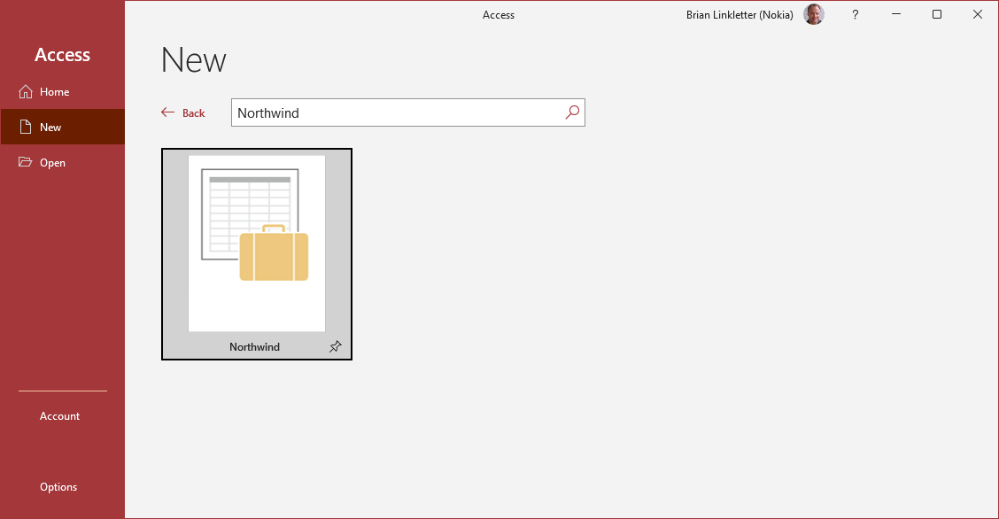
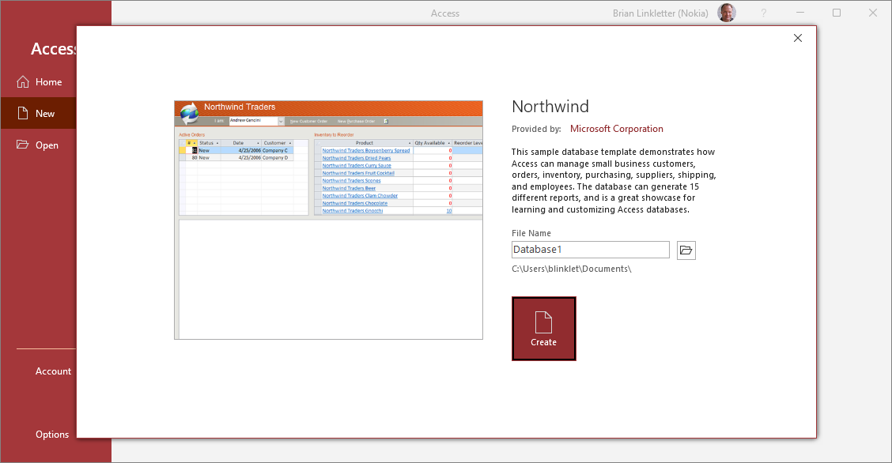

server like [Microsoft Access](https://www.microsoft.com/en-us/microsoft-365/access) on your laptop and then download a database backup from a public repository like the [Microsoft Northwind SQL Sample database](https://learn.microsoft.com/en-us/dotnet/framework/data/adonet/sql/linq/downloading-sample-databases#northwind_access). I tried that but could not find good information about how to connect SQLAlchemy to the Access Database on a Windows laptop.

## Microsoft Access

You already have access to Microsoft Access via Nokia's Office 365 corporate license. Install Access if you do not already have it.

Start Microsoft Access. Then, get the [Northwind sample database for Microsoft Access](https://learn.microsoft.com/en-us/dotnet/framework/data/adonet/sql/linq/downloading-sample-databases#northwind_access). 

Click on the *More templates* link on the Access screen. Search for *Northwind* in the *Search for Online Templates* field. The Northwind database should appear, as shown below:



Select the Northwind database to download it. You will see an information screen like the one below. Change the filename to *Northwind* and select the folder to which it will be downloaded. The click the *Create* button.



Microsoft Access will display its view of the database with a welcome screen, as shown below. We are not interested in using the MS Access interface. We want to connect to this database using SQLAlchemy.

## SQLAlchemy Access dialect

SQLAlchemy needs a *dialect* installed so you can connect it to Microsoft Access. Install the [sqlalchemy-access](https://pypi.org/project/sqlalchemy-access/) python package into your virtual environment.

```powershell
(env) > pip install sqlalchemy-access
```

Python program:

```python
from sqlalchemy import create_engine, URL, inspect

engine = create_engine(r'access+pyodbc://@northwind')
inspector = inspect(engine)
print(inspector.get_table_names())
```


[split Access database](https://support.microsoft.com/en-us/office/split-an-access-database-3015ad18-a3a1-4e9c-a7f3-51b1d73498cc) creates a backend database and removes all the Access-only analysis tables to a front-end

```
import pyodbc

conn = pyodbc.connect(r'Driver={Microsoft Access Driver (*.mdb, *.accdb)};DBQ=C:\Users\blinklet\Documents\Northwind.accdb;')
cursor = conn.cursor()
cursor.execute('select * from products')
for row in cursor.tables():
    print(row.table_name)
for row in cursor.fetchmany(2):
    print(row)
```


### Other sources

 

Another option is to create a database on the public SQL server at [db4free.net](https://www.db4free.net/). You will need to build a sample database from scratch, or from a backup file. The *db4free.net* service can only import very small database backups. While this service may be good for experimenting with databases, it is not that helpful for serving large datasets like those needed in data science.
