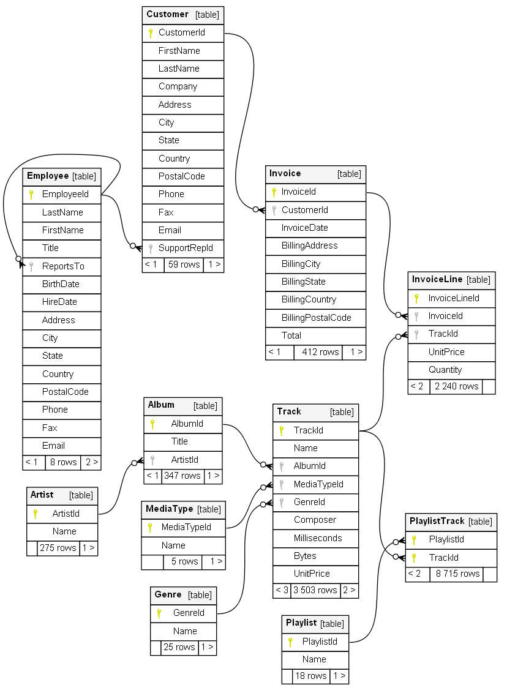
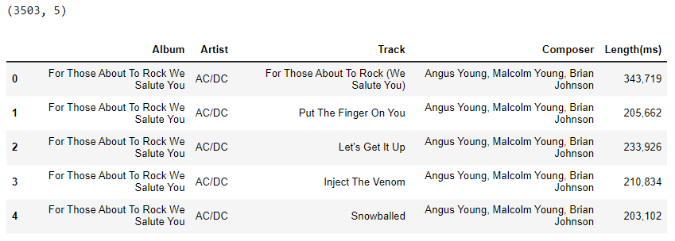
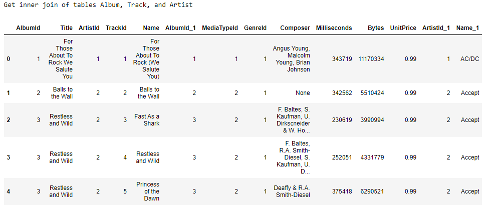
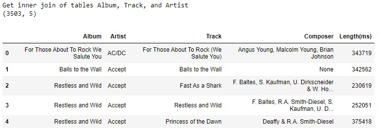
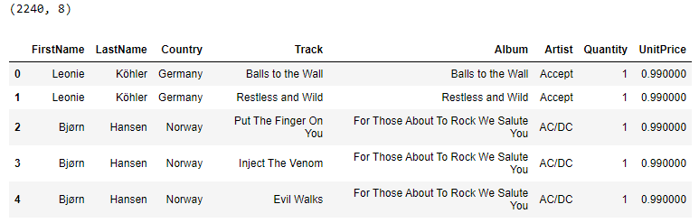
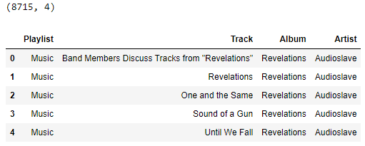
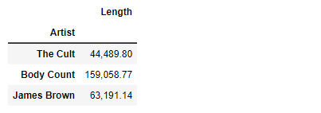
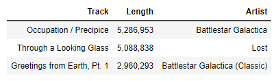

# Learning Data Science

This document outlines what I learned about the tools associated with data science, such as databases, and Python frameworks like [SQLalchemy](https://www.sqlalchemy.org/) and [Pandas](https://pandas.pydata.org/). 

For some reason, most data science books and blog avoid showing you how to get data stored in databases and, instead, work with simpler-to-use data sources like Excel files, CSV files, and text files. There are already [many](https://alongrandomwalk.com/2020/09/14/read-and-write-files-with-jupyter-notebooks/) [tutorials](https://www.digitalocean.com/community/tutorials/data-analysis-and-visualization-with-pandas-and-jupyter-notebook-in-python-3) [available](https://www.datacamp.com/tutorial/python-excel-tutorial) for these simpler examples.

Unfortunately, most of the beginner-level information about databases that is available on books and online is targeted at application developers. So, most sources describe how to design and build an empty database that will store data generated by an application, and retrieve it.

But, data scientists usually need to read large amounts of data from already-existing [databases](https://realpython.com/tutorials/databases/). They need to study an already-existing database's schema so they can understand how to best analyze the data stored in it. So, in this document I will show how we can easily read data from a database and load it into Pandas dataframes for further analysis.

Data Scientists do not usually design a database, write data to it, or change its design. So, to save space, I will not cover writing to or updating a database.

# Python and databases

Programmers who are have already mastered the SQL language could simply use the appropriate driver that is compatible with the SQL database they are using, such as [psycopg](https://www.psycopg.org/) for PostgreSQL, or [mysql-connector-python](https://dev.mysql.com/doc/connector-python/en/) for MySQL. Since we are using an SQLite database, we could use the [sqlite package](https://www.sqlite.org/index.html), which is part of the Python standard library. But, remember, you need to know the SQL query language when writing programs that use these Python database drivers.

We will focus on using Python code instead of using the SQL query language to get data from an SQL database. Using a Python database [Object Relational Mapper (ORM)](https://www.freecodecamp.org/news/what-is-an-orm-the-meaning-of-object-relational-mapping-database-tools/), instead of [SQL queries](https://www.postgresqltutorial.com/postgresql-tutorial/postgresql-select/), enables you to keep learning Python concepts and focus on improving as a Python developer. You don't have to detour to learn a different technology like SQL, although you will need to learn some basic SQL database concepts like how tables relate to each other and how tables can be joined to build larger data sets.

As you work with a database ORM like SQLAlchemy, you will eventually need to learn more about Python features such as [object-oriented programming](https://www.freecodecamp.org/news/object-oriented-programming-in-python/), [data classes](https://docs.python.org/3.11/library/dataclasses.html) and [type hints](https://towardsdatascience.com/type-hints-in-python-everything-you-need-to-know-in-5-minutes-24e0bad06d0b). This is a good opportunity to practice these topics.

# Set up your environment

Set up your development environment. Set up your database server, install Python on your laptop and configure a Python virtual environment in which you will install Jupyter notebooks, SQLAlchemy, and Pandas.

## Set up your database

You do not need to install a database server because we will use an SQLite database. We chose to use the SQLite database engine to serve the database because SQLite is the most widely used SQL database and because we do not need to install and configure a separate SQL server. SQLite is a file-based database and the SQLite database driver is built into the Python standard library.

## Install Python on your Windows laptop

Start by installing Python on your laptop. Go to the [Python web page](https://www.python.org/) for the most up-to-date information about installing python on your operating system. This document shows you how to install a single version of Python on a Windows laptop computer.

There are many ways to [install Python on Windows](https://learn.microsoft.com/en-us/windows/python/beginners#install-python). I recommend installing it from the *Microsoft Store*. Open the Microsoft Store app and search for Python. Install the latest version. [Python 3.11](https://apps.microsoft.com/store/detail/python-311/9NRWMJP3717K?hl=en-ca&gl=ca&activetab=pivot%3Aoverviewtab&rtc=1) was the latest version at the time I wrote this notebook so all examples use Python 3.11.

## Install Jupyter Notebooks

Many data scientists use [Jupyter notebooks](https://jupyter.org/) to develop and present their data science projects. This document uses a Jupyter Notebook as an advanced REPL that makes it easier to demonstrate the Python code used to access data from a database and analyze it.

To install Jupyter Notebooks:

* Create a new folder for your data science learning projects
* Create a Python virtual environment and activate it
* Install JupyterLab in your virtual environment and run a Jupyter Notebook

Open the [Windows Terminal](https://apps.microsoft.com/store/detail/windows-terminal/9N0DX20HK701?hl=en-us&gl=us) app.

Create a new folder that will store your virtual environment, notebook files, and other files you create while learning about data science. Navigate to your home folder, or to a subdirectory of your choice and create a folder named *data-science*:

```powershell
> mkdir data-science
```

Navigate into the folder you created and create a Python virtual environment. I chose to call mine, *env*.

```powershell
> cd data-science
> python -m venv env
```

Next, activate the virtual environment.

```powershell
> .\env\Scripts\activate
(env) > 
```

Install JupyterLab in the virtual environment. JupyterLab installs a lot of modules so you should keep it in a virtual environment to avoid messing up your Windows system.

```powershell
(env) > pip install jupyterlab
```

Run JupyterLab.

```powershell
(env) > jupyter notebook
```

The terminal will show multiple URLs that you can copy and paste into a web browser. Because you installed JupyterLab in a virtual environment, use one of the *localhost* URLs, like the following

```
http://localhost:8888/?token=678b6891879b80fc02488701d553b1a2b4
```

The token is needed the first time you use a new browser to access JupyterLab. After using it once, it is cached in the browser and you can connect to JupyterLab in the future with just the simple URL: 

```
http://localhost:8888
```

The Jupyter Notebook web interface looks like the image below.


### Alternative Jupyter interfaces

JupyterLab is the newer interface for Jupyter Notebooks and has more features.  If you want to open notebooks using the JupyterLab interface, start the Jupyter server with the following command, instead of using the `jupyter notebook` command. 

```
(env) > jupyter-lab
```

Also, you can [edit Jupyter Notebooks in the VS Code editor](https://code.visualstudio.com/docs/datascience/jupyter-notebooks). Install the VSCode [Python extension](https://code.visualstudio.com/docs/languages/python) and [Jupyter extension](https://marketplace.visualstudio.com/items?itemName=ms-toolsai.jupyter), then open the Notebook file in VS Code. The virtual environment must already be activated and the JupyterLab server must already be started.

## Install SQLAlchemy

[SQLAlchemy](https://www.sqlalchemy.org/) is a Python package that helps programmers [interact with SQL databases](https://towardsdatascience.com/sqlalchemy-python-tutorial-79a577141a91), without having to learn the SQL Query language. If you use the SQLAlchemy package, which has a learning curve of its own, then your code will be independent from the [SQL language differences](https://towardsdatascience.com/how-to-find-your-way-through-the-different-types-of-sql-26e3d3c20aab) between the various SQL databases like MySQL, PostgreSQL, and Microsoft SQL Server.

We'll use SQLAlchemy's [Object Relational Mapper (ORM)](https://docs.sqlalchemy.org/en/20/orm/), instead of [SQLAlchemy Core](https://docs.sqlalchemy.org/en/20/core/).

In your virtual environment, install SQLAchemy with the following command:

```powershell
(env) > pip install SQLAlchemy
```

## Install Pandas

[Pandas](https://pandas.pydata.org/pandas-docs/stable/index.html) is a Python package that makes working with relational or labeled data both easy and intuitive. It aims to be the fundamental high-level building block for doing practical, real-world data analysis in Python. [^1]

[^1]: From the [Pandas package overview documentation](https://pandas.pydata.org/pandas-docs/stable/getting_started/overview.html), accessed on Mach 17, 2023]

Install the Pandas Python package and supporting packages for converting Pandas dataframes to Microsoft Excel spreadsheets. Go to the terminal window that is running your virtual environment and enter the commands:

```powershell
(env) > pip install pandas
(env) > pip install openpyxl xlsxwriter xlrd
```

When Pandas is installed, [NumPy](https://numpy.org/) will also be installed because Pandas uses NumPy. NumPy (Numerical Python) is an open source Python library that’s used for working with numerical data in Python.


### New frameworks

While Pandas and NumPy are the current standard for data analytics in Python, some new projects are on the horizon that claim to be more modern and efficient. [Apache Arrow](https://arrow.apache.org/) could be used in place of NumPy and [Polars](https://www.pola.rs/) could be used in place of Pandas. For now, we will use Pandas, which uses Numpy.


# Get Data

To practice the basics of data science, you need data. Eventually, you need to learn how to work with many sources of data, such as:

* Databases such as SQL databases
* Excel and CSV files stored on a secure SharePoint site
* APIs of external services
* Web scraping

While you work in the Analytics team, most of the data you will access will come from a database or a file on a secure SharePoint site. Most of our data comes from the HRDP database.

When you are at the beginning of your learning, it may be best to practice on a "dummy" database so you do not accidentally cause issues with a production database. 

## Data sources

If you cannot get access to HRDP when you start experimenting with data science tools like Python and SQLAlchemy, use another available database for practice. There is lots of data [available to the public](https://www.dropbase.io/post/top-11-open-and-public-data-sources) that you may want to analyze as you learn more about data science. We want to learn how to analyze data stored in a database so we need data available in that format.

The best solution is to install an SQL database engine like [SQLite](https://www.sqlite.org/index.html) on your PC and download a database backup from a public repository. [Kaggle](https://www.kaggle.com/) offers many [database files that are suitable for learning data science](https://www.kaggle.com/datasets?search=SQL) but you have to be careful. Many databases offered by Kaggle are poorly designed and cause errors when SQLAlchemy performs database reflection. Experts may be able to work around these problems but they can frustrate beginners. Other, properly-designed databases like the [Northwind database](https://github.com/jpwhite3/northwind-SQLite3), or the [Chinook database](https://github.com/lerocha/chinook-database), may also be more suitable.

In this document, we will use the Chinook database, which is a public created that tries to emulate a media store's database. It contains customer names and addresses, invoice data, and data about media files for sale.

Clone the *[Chinook database repository](https://github.com/lerocha/chinook-database)* to your computer. In the Windows terminal, enter the commands:

```
git clone https://github.com/lerocha/chinook-database.git
cd chinook-database\ChinookDatabase\DataSources
dir *.sqlite
```

You will use the file *Chinook_Sqlite.sqlite* in your program.

```
Mode                 LastWriteTime         Length Name
----                 -------------         ------ ----
-a----        2023-03-06   8:28 AM        1067008 Chinook_Sqlite.sqlite
-a----        2023-03-06   8:28 AM        1067008 Chinook_Sqlite_AutoIncrementPKs.sqlite
```

## Connect to the database

Start a new Jupyter Notebook. In the first cell, enter the following code to prepare a connection to the database.

```python
from sqlalchemy import create_engine

engine = create_engine(r"sqlite:///C:/Users/blinklet/Documents/chinook-database/ChinookDatabase/DataSources/Chinook_Sqlite.sqlite")
```

Run the cell. The code will create an [engine](https://docs.sqlalchemy.org/en/20/core/engines_connections.html) object which represents a connection to the database specified in the URL passed to the *create_engine* function.

You are now ready to get data from the database connection.


# Build an SQLAlchemy model from an existing database

The SQLAlchemy ORM defines database tables as classes. The process of automatically building new classes based on an existing database schema is called [reflection](https://betterprogramming.pub/reflecting-postgresql-databases-using-python-and-sqlalchemy-48b50870d40f). If you start with a properly designed database, you can map classes and relationships using the [SQLAlchemy Automap extension](https://docs.sqlalchemy.org/en/20/orm/extensions/automap.html). Database reflection is useful when writing simple, single-use scripts like the ones in this document.

Instead of using reflection, it is better to use [Declarative Mapping](https://docs.sqlalchemy.org/en/20/orm/declarative_mapping.html) to build SQLAlchemy ORM classes. It enables program maintainers to see the database information expressed in Python code. It also makes a program more robust, because you will be better able to predict the impact that changes in the database schema will have on your program. See *Appendix A* for more information. However, Declarative Mapping requires you to learn more about the ORM than we can cover in this document. So, we use reflection in our example.

To automatically generate an object model from the Chinook database, add a new cell to your Jupyter notebook, and enter and run the following code:

```python
from sqlalchemy.ext.automap import automap_base
from sqlalchemy.orm import Session

Base = automap_base()
Base.prepare(autoload_with=engine)

print(*Base.metadata.tables, sep=", ")
```

You used the *automap_base* function to create a [declarative base class](https://docs.sqlalchemy.org/en/20/orm/extensions/automap.html#basic-use) named *Base* and then used its *prepare* method to reflect the schema and produce mappings. You should see the output displayed below, showing the table names in the Chinook database.

```
Album, Artist, Customer, Employee, Genre, Invoice, InvoiceLine, Track, MediaType, Playlist, PlaylistTrack
```

You know the Base object now maps the database structure because you were able to get the list of table names from the metadata created in the new Base object.

The output is similar to what we saw when we used the *inspect* function, previously because *inspect* also uses reflection to get the database schema information.

## View the ORM classes

The reason programmers use the SQLAlchemy ORM is so that they can treat database tables like Python classes in their programs and work in the "Pythonic" way. Let's find out some more information about the mapped classes that reflect the tables in the database.

List the SQLAlchemy classes mapped by the automap extension.

```python
print(*Base.classes.keys(), sep=", ")
```

You should see the output displayed below, showing the table names in the Chinook database.

```
Album, Artist, Customer, Employee, Genre, Invoice, InvoiceLine, Track, MediaType, Playlist
```

If you compare the tables found using the *inspect* function and the *Base.metadata* object to the classes found in the *Base.classes* object, you will see that we have eleven tables but only ten ORM classes. This is because the *PlaylistTrack* table is an association table. SQLAlchemy ORM does not automatically create a class for an association table. It instead represents it as a table with foreign keys pointing to columns in the other tables.

## ORM Metadata

You can view more information about the tables declared in the ORM by parsing through the database class's metadata. You can learn the data types of each column. for example. To see a rough listing of all of the metadata for the *Album* table, run the following code:

```python
print(repr(Base.metadata.tables['Album']))
```

You see the following output:

```
Table('Album', MetaData(), Column('AlbumId', INTEGER(), table=<Album>, primary_key=True, nullable=False), Column('Title', NVARCHAR(length=160), table=<Album>, nullable=False), Column('ArtistId', INTEGER(), ForeignKey('Artist.ArtistId'), table=<Album>, nullable=False), schema=None)
```

If you wanted to see metadata for every table in the database schema, run the following code:

```python
meta = Base.metadata.tables.items()
for i in meta:
    print(i, end="\n\n")
```

You can find out any existing relationships between tables by looking at the columns defined as primary keys and secondary keys. The following code will print out table name, column names, primary keys, and foreign keys of any table in an easy-to-read format:

```python
from sqlalchemy.schema import ForeignKey
from tabulate import tabulate

def table_info(table_name):
    headers = [
        'Column Name',
        'Primary Key',
        'Foreign Key', 
        'Relationship'
    ]

    body = list()
    table = Base.metadata.tables[table_name]
    
    print(f"Table: {table_name}")
    
    for col in table.columns:
        line = dict.fromkeys(headers)
        line['Column Name'] = col.name
        
        if col.primary_key:
            line['Primary Key'] = "YES"
        
        if col.foreign_keys:
            line['Foreign Key'] = "YES"
            z = set(col.expression.foreign_keys)[.pop()]
            if isinstance(z, ForeignKey):
                line['Relationship'] = z.target_fullname
        
        body.append(line)
    
    rows =  [x.values() for x in body]
    return(
        tabulate(
            rows, 
            headers, 
            colalign=('left','center','center','left'), 
            tablefmt='psql'
        )
    )
```

Call the *table_info()* function, as shown below:

```python
print(table_info("PlaylistTrack"))
print("\n")
print(table_info("Track"))
```

You should see the two tables described, with each table's output looking like the below text:

```
Table: PlaylistTrack
+---------------+---------------+---------------+---------------------+
| Column Name   |  Primary Key  |  Foreign Key  | Relationship        |
|---------------+---------------+---------------+---------------------|
| PlaylistId    |      YES      |      YES      | Playlist.PlaylistId |
| TrackId       |      YES      |      YES      | Track.TrackId       |
+---------------+---------------+---------------+---------------------+


Table: Track
+---------------+---------------+---------------+-----------------------+
| Column Name   |  Primary Key  |  Foreign Key  | Relationship          |
|---------------+---------------+---------------+-----------------------|
| TrackId       |      YES      |               |                       |
| Name          |               |               |                       |
| AlbumId       |               |      YES      | Album.AlbumId         |
| MediaTypeId   |               |      YES      | MediaType.MediaTypeId |
| GenreId       |               |      YES      | Genre.GenreId         |
| Composer      |               |               |                       |
| Milliseconds  |               |               |                       |
| Bytes         |               |               |                       |
| UnitPrice     |               |               |                       |
+---------------+---------------+---------------+-----------------------+
```

In the listing above, you can [identify](https://condor.depaul.edu/gandrus/240IT/accesspages/relationships.htm) that the *PlaylistTrack* table is an [association table](https://docs.sqlalchemy.org/en/20/orm/basic_relationships.html#many-to-many) that supports a [many-to-many relationships](https://medium.com/@BryanFajardo/how-to-use-associative-entities-in-relational-databases-4456a2c71cda) between two other tables. A typical association table has two columns and each of its columns are both Primary Keys and Foreign Keys. 

Association tables are declared differently in the ORM than normal tables in the SQLAlchemy ORM. They are not reflected as ORM classes so there will be no *PlaylistTrack* class in the ORM. The association table is defined as a table object in the ORM.

After looking at all the information output, you should be able to draw a diagram showing the database tables and relationships, like the one below:



## Assign table classes

So that you can more easily use the reflected tables, assign each SQLAlchemy ORM class to a variable so it is easier to work with. Create a new Jupyter Notebook cell and run the following code:

```python
Album = Base.classes.Album
Artist = Base.classes.Artist
Customer = Base.classes.Customer
Employee = Base.classes.Employee
Genre = Base.classes.Genre
Invoice = Base.classes.Invoice
InvoiceLine = Base.classes.InvoiceLine
MediaType = Base.classes.MediaType
Playlist = Base.classes.Playlist
Track = Base.classes.Track
playlisttrack = Base.metadata.tables['PlaylistTrack']
```

# Get data from the database

Up until now, we've been playing with the information you can get about the database schema and how to define the ORM's declarative base object automatically when working with an existing database. Next, we need to get data out of that database so we can analyze it.

In this example, we will use the [Pandas framework](https://pandas.pydata.org/) to get data from the database. You can also query the database using SQLAlchemy but, since we will use Pandas to analyze data, we will also use it to query data.

## Query data and convert it into Pandas dataframes

Create an SQLAlchemy query and load its results into a Pandas dataframe. First, open a [session](https://docs.sqlalchemy.org/en/20/orm/session_basics.html) and ask for all the data in one table.

```python
import pandas as pd

albums = pd.read_sql_table(table_name='Album', con=engine)

print(albums)
```

The output looks like below. 

```
     AlbumId                                              Title  ArtistId
0          1              For Those About To Rock We Salute You         1
1          2                                  Balls to the Wall         2
2          3                                  Restless and Wild         2
3          4                                  Let There Be Rock         1
4          5                                           Big Ones         3
..       ...                                                ...       ...
342      343                             Respighi:Pines of Rome       226
343      344  Schubert: The Late String Quartets & String Qu...       272
344      345                                Monteverdi: L'Orfeo       273
345      346                              Mozart: Chamber Music       274
346      347  Koyaanisqatsi (Soundtrack from the Motion Pict...       275

[347 rows x 3 columns]
```

The output shows that Pandas successfully [queried the database](https://docs.sqlalchemy.org/en/20/orm/queryguide/index.html) and saved the query results in a dataframe. Pandas automatically truncates the displayed output if the number of rows or columns exceeds the default length. You can see the default length by executing the following code:

```python
print(pd.options.display.max_rows)
print(pd.options.display.max_columns)
```

You will see the default maximum number of rows that can be viewed is 60 and the default maximum number of columns that can be viewed is 20.

## Joining datafames

To get more interesting data sets, we need to join database tables. For now, we will accomplish this by reading different tables into Pandas dataframes and merge the dataframes. First, create a new dataframe by reading teh contents of the Atyist table:

```python
artists = pd.read_sql_table(table_name='Artist', con=engine)
```

Have a look at the Artist table's data. To keep the output readable, use the Pandas dataframe's *head()* method, which outputs only the first five rows of the dataframe.

```python
print(artists.head())
```

The output should look like: 

```
   ArtistId               Name
0         1              AC/DC
1         2             Accept
2         3          Aerosmith
3         4  Alanis Morissette
4         5    Alice In Chains
```

I want to create a dataframe that lists the full artist name associated with every album. So, I will merge the dataframe *albums*, which contains the Album table's data, and the dataframe *artists*, which contains the Artist table's data, into a new dataframe named *df1*.

```python
df1 = pd.merge(left = albums, right = artists, how = 'inner')
print(df1.shape)
print(df1.head())
```

I used the Pandas dataframe *shape* attribute to check the number of rows and columns in the dataframe, since I am only displaying the first five rows.

```
(347, 4)
   AlbumId                                  Title  ArtistId       Name
0        1  For Those About To Rock We Salute You         1      AC/DC
1        4                      Let There Be Rock         1      AC/DC
2        2                      Balls to the Wall         2     Accept
3        3                      Restless and Wild         2     Accept
4        5                               Big Ones         3  Aerosmith
```

Pandas does not know about the relationships between the tables in the database. It assumes that the inner join will be performed by matching columns from each dataframe that have the same name. If you need to join on columns that do not have the same names, you can specify which columns to join on in the Pandas *merge()* method's parameters.

You can remove the "ArtistId" column from the data frame because it is now redundant. Keep the *AlbumId* column because you will use it to join data from the Track table in the next step. 

```python
df1.drop('ArtistId', axis=1)
```

You can also rename the *Name* column to *Artist* so it is clearer.

```
df1.rename(columns = {'Name':'Artist'})
```

Also, you could have done everything in one statement when you merged the dataframes by chaining pandas methods together:

```python
df1 = (pd
     .merge(albums, artists)
     .drop('ArtistId', axis=1)
     .rename(columns = {'Name':'Artist'}))
```

Now get data from a third table and merge it with the dataframe *df1*. Get the data from the Track table and load it into a pandas dataframe named *tracks*:

```python
tracks = pd.read_sql_table(table_name='Track', con=engine)
```

If you print the first few rows of the *tracks* dataframe, you can see it has 3,503 rows and nine columns. You should expect that Pandas will use the *AlbumId* column in the dataframe *df1* to join on the AlbumId column in dataframe *tracks*.

```python
print(tracks.head())
print(tracks.shape)
```
```
   TrackId                                     Name  AlbumId  MediaTypeId  \
0        1  For Those About To Rock (We Salute You)        1            1   
1        2                        Balls to the Wall        2            2   
2        3                          Fast As a Shark        3            2   
3        4                        Restless and Wild        3            2   
4        5                     Princess of the Dawn        3            2   

   GenreId                                           Composer  Milliseconds  \
0        1          Angus Young, Malcolm Young, Brian Johnson        343719   
1        1                                               None        342562   
2        1  F. Baltes, S. Kaufman, U. Dirkscneider & W. Ho...        230619   
3        1  F. Baltes, R.A. Smith-Diesel, S. Kaufman, U. D...        252051   
4        1                         Deaffy & R.A. Smith-Diesel        375418   

      Bytes  UnitPrice  
0  11170334       0.99  
1   5510424       0.99  
2   3990994       0.99  
3   4331779       0.99  
4   6290521       0.99  
(3503, 9)
```

You can see how Pandas displays the nine columns by spitting the displayed tables into three "rows". And you can see that we have 3,503 rows in the Tracks table.

Finally, merge the *tracks* dataframe with the *df1* dataframe and, at the same time, delete unneeded columns and rename other columns:

```python
df3 = (pd
     .merge(df1, tracks)
     .drop(['AlbumId','TrackId',
            'Bytes','UnitPrice',
            'MediaTypeId','GenreId'], axis=1)
     .rename(columns = {'Name':'Track', 
                        'Title':'Album',
                        'Milliseconds':'Length(ms)'}))

print(df3.shape)
display(df3.head().style.format(thousands=","))
```

Since we are using a Jupyter Notebook, we can use the [*display* function](https://datascientyst.com/style-pandas-dataframe-like-pro-examples/) to output a [styled table](https://pandas.pydata.org/pandas-docs/stable/user_guide/style.html) that is more readable. The output looks like below:



Now you have a tables showing 3,503 tracks with information about the album, artists, composer, and length of each track.

# Generating SQL statements in SQLAlchemy

The pandas *read_sql_table* method reads all the rows from the requested table from the SQL database and stores them in a pandas dataframe.

Sometimes, however, you may want more control over exactly how much data you pull into your program. If you want to get specific information from the database, you can create SQLAlchemy ORM statements and use the pandas *read_sql* method to read groups of rows, single rows, or filtered rows from the database.

for example, the following code uses the SQLAlchemy select function to build an SQL query that selects all rows in the Album table. 

```python
statement = (select(Artist))

dataframe = pd.read_sql(sql=statement, con=engine)

print(dataframe.shape)
print(dataframe.head(5))
```

This program gets the same data as a previous program where we used the *read_sql_table* method:

```
(275, 2)
   ArtistId               Name
0         1              AC/DC
1         2             Accept
2         3          Aerosmith
3         4  Alanis Morissette
4         5    Alice In Chains
```

You can see it read in all 275 rows in the table.

As another example, let's say we only wanted to analyze data from the band, "Alice in Chains". Instead of gathering all 275 rows into a dataframe and then using the *pandas.where()* method to filter output by band name, we can run change the statement so it filters the data before it is passed into the pandas dataframe.

```python
statement = (select(Artist).where(Artist.Name=='Alice In Chains'))

dataframe = pd.read_sql(sql=statement, con=engine)

print(dataframe.shape)
print(dataframe.head(5))
```
```
(1, 2)
   ArtistId             Name
0         5  Alice In Chains
```

This returned only one row. If you have data sets that are very large, you can imagine how important it can be to filter data before it is loaded into a pandas dataframe.

What if you wanted to analyze data from a random sample of five artists, and you wanted to filter the data before loading it into a pandas dataframe? You could change the statement to the following:

```python
statement = (select(Artist).order_by(func.random()).limit(5))

dataframe = pd.read_sql(sql=statement, con=engine)

print(dataframe.shape)
print(dataframe.head(5))
```
```
(5, 2)
   ArtistId                Name
0       247  The King's Singers
1       191         Nação Zumbi
2       251            Fretwork
3        36             O Rappa
4        94        Jimi Hendrix
```

## Linking joined tables in SQLAlchemy

Another way to create the dataframe containing album and track information from the Chinook database is to perform the table joins in the SQLAlchemy ORM query so that Pandas receives the final dataframe in one step. This may be more desirable than using the *pd.merge* method because it simplifies your Pandas operations and may be more efficient. 

In a properly-designed database, the relationships between tables are already defined using foreign keys and association tables. SQLAlchemy objects can use these relationships to automatically connect data in different tables together.

Using the *table_info* function you created earlier, look at teh relationships between the tables named *Album*, *Track*, and *Artist*.

```python
print(table_info('Album'))
print(table_info('Track'))
print(table_info('Artist'))
```

This shows us the following relationships:

```
Table: Album
+---------------+---------------+---------------+-----------------+
| Column Name   |  Primary Key  |  Foreign Key  | Relationship    |
|---------------+---------------+---------------+-----------------|
| AlbumId       |      YES      |               |                 |
| Title         |               |               |                 |
| ArtistId      |               |      YES      | Artist.ArtistId |
+---------------+---------------+---------------+-----------------+
Table: Track
+---------------+---------------+---------------+-----------------------+
| Column Name   |  Primary Key  |  Foreign Key  | Relationship          |
|---------------+---------------+---------------+-----------------------|
| TrackId       |      YES      |               |                       |
| Name          |               |               |                       |
| AlbumId       |               |      YES      | Album.AlbumId         |
| MediaTypeId   |               |      YES      | MediaType.MediaTypeId |
| GenreId       |               |      YES      | Genre.GenreId         |
| Composer      |               |               |                       |
| Milliseconds  |               |               |                       |
| Bytes         |               |               |                       |
| UnitPrice     |               |               |                       |
+---------------+---------------+---------------+-----------------------+
Table: Artist
+---------------+---------------+---------------+----------------+
| Column Name   |  Primary Key  |  Foreign Key  | Relationship   |
|---------------+---------------+---------------+----------------|
| ArtistId      |      YES      |               |                |
| Name          |               |               |                |
+---------------+---------------+---------------+----------------+
```

We see that the Album table has a foreign key that points to the Artist table and that the Track table has a foreign key that points to the Album table.

Knowing that these relationships exist, we can simply join all the data from multiple tables together using the *select()* functions' *join()* method. Here we select data from the Album, Track, and Artist tables by joining the Track and Artist tables with the Album table.

```python
print(f"Get inner join of tables Album, Track, and Artist")
statement = (select(Album, Track, Artist)
     .join(Track)
     .join(Artist)
    )
```

Use the pandas *read_sql* method to get data selected by the statement and load it into a dataframe.

```python
df4 = pd.read_sql(sql=q.statement, con=engine)

print(df4.shape)
display(df4.head())
```

The resulting dataset will look like the following:




You can see the columns, and the column names assigned by SQLAlchemy the query result. To get only the specific columns you need, create a new statement that will select each column by name, starting with the *Album.Title* column. Then, [rename the columns](https://devsheet.com/code-snippet/column-name-as-alias-name-sqlalchemy/) in the select statement using the *label* method.

```python
print(f"Get inner join of tables Album, Track, and Artist")

statement = (select(Album.Title.label("Album"),
            Artist.Name.label("Artist"),
            Track.Name.label("Track"),
            Track.Composer, 
            Track.Milliseconds.label("Length"))
     .join(Track)
     .join(Artist)
    )

```

Load the selected data from the database into a pandas dataframe:

```python
dataframe = pd.read_sql(sql=statement, con=engine)

print(dataframe.shape)
display(dataframe.head().style.format(thousands=","))
```

The result is shown below:




You see that joining tables and selecting specific columns in an SQLAlchemy query can give you the data you need in one step. Reading that data into a Pandas dataframe makes it easy to analyze the results.

You can create very large datasets by joining many tables together. As you create more complex queries, SQLAlchemy may not be able to automatically choose how tables will join. You can assist SQLAlchemy in determining relationships between tables by using the *join_from* method, which will specify which tables are on teh left and right side of a join. 

For example, if you want to know the names of all the tracks purchased by each customer, create the following SQLAlchemy select statement:

```python
statement = (select(Customer.FirstName,
                    Customer.LastName,
                    Customer.Country,
                    Track.Name.label("Track"),
                    Album.Title.label("Album"),
                    Artist.Name.label("Artist"),
                    InvoiceLine.Quantity,
                    InvoiceLine.UnitPrice
                    )
                .join_from(InvoiceLine, Invoice)
                .join_from(Invoice, Customer)
                .join_from(InvoiceLine, Track)
                .join_from(Track, Album)
                .join_from(Album, Artist))
```

Read the data selected by the statement into a pandas dataframe:

```python
dataframe = pd.read_sql(sql=statement, con=engine)

print(dataframe.shape)
display(dataframe.head(5).style.format(thousands=","))
```

See that the output looks like that below:




I used the *join_from()* method to make the left and right sides of each join clearer to the program. normally it can infer the correct relationships but sometimes you need to be more specific.

And, to use the association table, if you want to see all the tracks on all the playlists:

```python
statement = (select(Playlist.Name.label("Playlist"),
                    Track.Name.label("Track"),
                    Album.Title.label("Album"),
                    Artist.Name.label("Artist")
                    )
                .join_from(Playlist, playlisttrack)
                .join_from(playlisttrack, Track)
                .join_from(Track, Album)
                .join_from(Album, Artist))

dataframe = pd.read_sql(sql=statement, con=engine)

print(dataframe.shape)
display(dataframe.head(5))
```

The result was a dataframe with 4 columns and 8,715 rows.



# SQLAlchemy

Up until this point, we have been using Pandas to query the SQL database, using an SQLAlchemy ORM select statement that tells Pandas which data to pull from the database. This works well when you want to gather large data sets into Pandas for organization and analysis.

There may be times when you want to read data from an SQL database and receive the result directly, without loading it into a Pandas dataframe. You do this using the SQLAlchemy's *Session* object. 

Create a new database session named *session* by calling the *Session* class and passing it the *engine* object you created at the start of this document, using SQLAlchemy's *create_engine* method. 

For example, using the SQLAlchemy *select* statement you created earlier as the parameter to the *session.execute* method, get a Result object from the database:

```python
with Session(engine) as session:
    print(type(session.execute(statement)))
    print(session.execute(statement))
```
```
<class 'sqlalchemy.engine.result.ChunkedIteratorResult'>
<sqlalchemy.engine.result.ChunkedIteratorResult object at 0x00000173831B5550>
```

The Result object is connected to the database session and gives you access to all the rows returned by the execution of the *select* statement. It does not actually contain data but it sends you data from the database every time you iterate on it. You need to iterate through the result to get rows from the database.

To get rows from the database, use an iterator like a *for* loop or the *next* function. Each iteration returns a *Row* object

```python
with Session(engine) as session:
    result = session.execute(statement)

    print(next(result))
    print(next(result))
    print(type(result))
```
```
('For Those About To Rock We Salute You', 'AC/DC', 'For Those About To Rock (We Salute You)', 'Angus Young, Malcolm Young, Brian Johnson', 343719)
('Balls to the Wall', 'Accept', 'Balls to the Wall', None, 342562)
<class 'sqlalchemy.engine.result.ChunkedIteratorResult'>
```

Here is an example of iterating through the result using a *for* loop. In this case, I added some code to limit the output to four rows.

```python
with Session(engine) as session:
    limit = 4
    result = session.execute(statement)
    for index, item in enumerate(result, start=1):
        print(item)
        if index == limit:
            break
```
```
('For Those About To Rock We Salute You', 'AC/DC', 'For Those About To Rock (We Salute You)', 'Angus Young, Malcolm Young, Brian Johnson', 343719)
('Balls to the Wall', 'Accept', 'Balls to the Wall', None, 342562)
('Restless and Wild', 'Accept', 'Fast As a Shark', 'F. Baltes, S. Kaufman, U. Dirkscneider & W. Hoffman', 230619)
('Restless and Wild', 'Accept', 'Restless and Wild', 'F. Baltes, R.A. Smith-Diesel, S. Kaufman, U. Dirkscneider & W. Hoffman', 252051)
```

When you print a *Row* object, it displays a tuple containing values from each column in that row. But, it is still a Row object so you can get data from any column in the row by addressing it by column name, as follows:

```python
with Session(engine) as session:
    result = session.execute(statement)

    x = next(result).Artist
    print(x)
    print(type(x))
```
```
AC/DC
<class 'str'>
```

You can get the column headers from the database and use them to identify table columns in your program. The *keys()* method returns a list of headers, as shown below:

```python
with Session(engine) as session:
    result = session.execute(statement)
    headers = result.keys()
    print(headers)
```
```
RMKeyView(['Playlist', 'Track', 'Album', 'Artist'])
```

Another way to get a number of rows from a table is to use the Result object's *fetchmany()* method, as shown below:

```python
with Session(engine) as session:
    result = session.execute(statement)
    headers = result.keys()
    table = result.fetchmany(4)

print(tuple(headers))
for row in table:
    print(row)
```
```
('Album', 'Artist', 'Track', 'Composer', 'Length')
('For Those About To Rock We Salute You', 'AC/DC', 'For Those About To Rock (We Salute You)', 'Angus Young, Malcolm Young, Brian Johnson', 343719)
('Balls to the Wall', 'Accept', 'Balls to the Wall', None, 342562)
('Restless and Wild', 'Accept', 'Fast As a Shark', 'F. Baltes, S. Kaufman, U. Dirkscneider & W. Hoffman', 230619)
('Restless and Wild', 'Accept', 'Restless and Wild', 'F. Baltes, R.A. Smith-Diesel, S. Kaufman, U. Dirkscneider & W. Hoffman', 252051)
```

To explore what types are returned by the *session.execute.keys()*, *session.execute.fetchmany()* methods, run the following code:

```python
print(type(headers))
print(type(table))
for row in table:
    print(type(row))
```

We see the following output:

```
<class 'sqlalchemy.engine.result.RMKeyView'>
<class 'list'>
<class 'sqlalchemy.engine.row.Row'>
<class 'sqlalchemy.engine.row.Row'>
<class 'sqlalchemy.engine.row.Row'>
<class 'sqlalchemy.engine.row.Row'>
```

From this output, we see

* The *keys()* method returns a RMKeyView object, which can be converted to an interable, list, or tuple using the Python *iter()*, *list()*, or *tuple()* functions.
* The *fetchmany()* method returns a list that contains Row objects, which are similar to [Named Tuples](https://docs.python.org/3/library/collections.html#collections.namedtuple). But, when printed, they look like normal Tuples.


## More session methods

The SQLAlchemy session object offers [several methods for querying](https://docs.sqlalchemy.org/en/20/orm/session_basics.html#querying) rows or items from a database. You can use the *execute()* method to get a result containing database rows, the *scalars()* method to get results containing single items from each row, or the [*scalar()* method](https://docs.sqlalchemy.org/en/20/orm/session_api.html#sqlalchemy.orm.Session.scalars) to get the actual value of a single item in a single row.

Below is an example of using the various methods, and chaining additional methods onto either the original statement object or onto the session object.

The *session.execute()* method returns a SQLAlchemy ORM Result object.

```python
session = Session(engine)
print(session.execute(statement))
```
```
<sqlalchemy.engine.result.ChunkedIteratorResult object at 0x0000016E8881BBD0>
```

The *session.execute()* method's *first()* method returns the first row in the Result object.

```python
print(session.execute(statement).first())
```
```
('For Those About To Rock We Salute You', 'AC/DC', 'For Those About To Rock (We Salute You)', 'Angus Young, Malcolm Young, Brian Johnson', 343719)
```

The *fetchmany()* method returns the specified number rows and returns them in a list of Row objects.

```python
print(session.execute(statement).fetchmany(2))
```
```
[('For Those About To Rock We Salute You', 'AC/DC', 'For Those About To Rock (We Salute You)', 'Angus Young, Malcolm Young, Brian Johnson', 343719), ('Balls to the Wall', 'Accept', 'Balls to the Wall', None, 342562)]
```

The *fetchall()* method gets all rows in the Result object and returns them in a list of Row objects. In this case, adding the *limit()* method to the statement causes the Result object to have only two rows in it.

```python
print(session.execute(statement.limit(2)).fetchall())
```
```
[('For Those About To Rock We Salute You', 'AC/DC', 'For Those About To Rock (We Salute You)', 'Angus Young, Malcolm Young, Brian Johnson', 343719), ('Balls to the Wall', 'Accept', 'Balls to the Wall', None, 342562)]
```

The *session.scalars()* method returns a SQLAlchemy ORM Scalars object, which, when iterated, looks like a list containing a series of values that come from the first column of each row in results returned by executing the SQL statement.

```python
print(session.scalars(statement))
```
```
<sqlalchemy.engine.result.ScalarResult object at 0x0000016E8886F0D0>
```

The *session.scalars()* method's *first()* method returns the first value from the series.

```python
print(session.scalars(statement).first())
```
```
For Those About To Rock We Salute You
```

The *fetchmany()* method returns the specified number of items and returns them in a list of values.

```python
print(session.scalars(statement).fetchmany(2))
```
```
['For Those About To Rock We Salute You', 'Balls to the Wall']
```

The *session.scalar()* method returns one value from the SQL statement's results. It returns the value in the first column of the first row.

```python
print(session.scalar(statement))
session.close()
```
```
For Those About To Rock We Salute You
```

## Selecting rows

You can create an SQL statement that search for rows that match a specified criteria. For example, here is a script that returns the first four records the artist named "Alice in Chains" and prints the track names and composer of each track.

```python
statement = (select(Album.Title.label("Album"),
            Artist.Name.label("Artist"),
            Track.Name.label("Track"),
            Track.Composer, 
            Track.Milliseconds.label("Length"))
     .join(Track)
     .join(Artist)
     .where(Artist.Name == 'Alice In Chains')
    )

with Session(engine) as session:
    result = session.execute(statement).fetchall()
    
print()
for row in result:
    print(f"Track name: {row.Track:18} Composer: {row.Composer}")
```
```
Track name: We Die Young       Composer: Jerry Cantrell
Track name: Man In The Box     Composer: Jerry Cantrell, Layne Staley
Track name: Sea Of Sorrow      Composer: Jerry Cantrell
Track name: Bleed The Freak    Composer: Jerry Cantrell
Track name: I Can't Remember   Composer: Jerry Cantrell, Layne Staley
Track name: Love, Hate, Love   Composer: Jerry Cantrell, Layne Staley
Track name: It Ain't Like That Composer: Jerry Cantrell, Michael Starr, Sean Kinney
Track name: Sunshine           Composer: Jerry Cantrell
Track name: Put You Down       Composer: Jerry Cantrell
Track name: Confusion          Composer: Jerry Cantrell, Michael Starr, Layne Staley
Track name: I Know Somethin (Bout You) Composer: Jerry Cantrell
Track name: Real Thing         Composer: Jerry Cantrell, Layne Staley
```

# Pandas or SQL?

Data selection, filtering, and manipulation can be done on the SQL database server, using SQLAlchemy ORM queries, or on your workstation, using Pandas. 

In the end, your decision about whether you join and manipulate your data in Pandas or in the SQLAlchemy query will depend on issues like the purpose of your application, the size of the database tables and pandas dataframes, database server performance, and the processing and memory resources available on your workstation.

In my opinion, if your data comes from a database, you should do most of your data joining and filtering using the database and then use Pandas for additional data cleaning and analysis. If your data comes from spreadsheets or CSV files, you have to use Pandas to combine, filter, clean, and analyze data.

## Data analysis using Pandas

<!--fix-->
Use SQLAlchemy ORM to create a joined table containing the data we need for analysis and load that data into a dataframe. 

For example, Load data from the database into a dataframe named *df4* that contains track information, including prices. 

```python
albums = pd.read_sql_table(table_name='Album', con=engine)
artists = pd.read_sql_table(table_name='Artist', con=engine)
tracks = pd.read_sql_table(table_name='Track', con=engine)

df1 = (pd
     .merge(albums, artists)
     .rename(columns = {'Name':'Artist'}))

data = (pd
     .merge(df1, tracks)
     .rename(columns = {'Name':'Track', 
                        'Title':'Album',
                        'Milliseconds':'Length'}))

print(f"Longest track: {data.Length.max():d}")
print(f"Shortest track: {data.Length.min():,}")
print(f"How many blanks in Composer column?: "
      f"{data.Composer.isnull().sum():,}")
print(f"Track length mean: {data.Length.mean():,.2f}")
print(f"Track length median: {data.Length.median():,.2f}")
print(f"Artist mode: {data.Artist.mode()[0]}")
print(f"Correlation between Length and UnitPrice: "
      f"{data['Length'].corr(data['UnitPrice']):,.2f}")
print(f"Track length standard deviation: "
      f"{data.Length.std():,.2f}")
```

Which outputs the following:

```
Longest track: 5286953
Shortest track: 1,071
How many blanks in Composer column?: 978
Track length mean: 393,599.21
Track length median: 255,634.00
Artist mode: Iron Maiden
Correlation between Length and UnitPrice: 0.93
Track length standard deviation: 535,005.44
```

You can also use the Pandas *describe* function to get statistical information about any column in a dataframe. For example, to get statistics about the length of all tracks in the dataframe:

```python
print(data.Length.describe())
```
```
count    3.503000e+03
mean     3.935992e+05
std      5.350054e+05
min      1.071000e+03
25%      2.072810e+05
50%      2.556340e+05
75%      3.216450e+05
max      5.286953e+06
Name: Length, dtype: float64
```

Or, to get statistics about the artist names in the dataframe:

```python
print(data.Artist.describe())
```
```
count            3503
unique            204
top       Iron Maiden
freq              213
Name: Artist, dtype: object
```

You can see that the type of information you get depends on the data type of the column.

Group and select data. You can use Pandas to [group and aggregate data](https://realpython.com/pandas-groupby/).

For example, the following code groups the dataframe by Artist and calculates the standard deviation of all the track lengths created by each artist. 

```python
print(f"Track length standard deviation for a sample of artists:")
pd.options.display.float_format = '{:,.2f}'.format
pd.options.styler.format.thousands= ','

display(
    data
    .groupby(['Artist'])['Length'] 
    .std()
    .dropna()
    .sample(3)
    .to_frame()
)
```

The following code displays the three longest tracks in the dataframe:



```python
print(f"Longest tracks, with artist name:")
display(
    data[['Track','Length','Artist']]
    .nlargest(3, 'Length')
    .style.hide(axis="index")
)
```



The following code counts the number of tracks created by each artist artist, from a random sample of artists:

```python
print(f"Number of tracks per artist, from a sample of artists::")
display(
    data
    .groupby('Artist')['Track']
    .count()
    .sample(3)
    .to_frame()
)
```


The following code lists the shortest tracks by the artist named "Guns N' Roses":

```python
print(f"Shortest tracks by Artist=Guns N' Roses: ")
gnr = data.loc[data.Artist == "Guns N' Roses"]
gnr_shortest = gnr[['Track','Length']].nsmallest(3, 'Length')
display(
    gnr_shortest
    .style.hide(axis="index")
)   
```


## Data analysis using SQLAlchemy queries

You may also analyze data using SQLAlchemy queries and functions. Many database engines support functions like maximum, minimum, and standard deviation. The functions supported may vary for each database engine. The SQLite database engine supports relatively few functions.

If you are writing an application that needs direct access to data from a database, you may want to see more examples of SQLAlchemy statements.

The following SQLAlchemy statements use [functions available in the SQLite database engine](https://www.techonthenet.com/sqlite/functions/index.php) and will display similar results to the Pandas dataframe work we did previously. 

First, write code that maps the structure of the database:

```python
from sqlalchemy import create_engine, select, func
from sqlalchemy.ext.automap import automap_base
from sqlalchemy.orm import Session

engine = create_engine(r"sqlite:///C:/Users/blinklet/Documents/chinook-database/ChinookDatabase/DataSources/Chinook_Sqlite.sqlite")

Base = automap_base()
Base.prepare(autoload_with=engine)

Album = Base.classes.Album
Artist = Base.classes.Artist
Customer = Base.classes.Customer
Employee = Base.classes.Employee
Genre = Base.classes.Genre
Invoice = Base.classes.Invoice
InvoiceLine = Base.classes.InvoiceLine
MediaType = Base.classes.MediaType
Playlist = Base.classes.Playlist
Track = Base.classes.Track
playlisttrack = Base.metadata.tables['PlaylistTrack']
```

Then write the folloing SQLAlchemy queries, which use database functions, and some Python functions to analyze the data in the database.

```python
with Session(engine) as session:
    statement = select(func.max(Track.Milliseconds))
    length = session.scalar(statement)
    print(f"Longest track length: {length:,.0f}")

    statement = select(func.min(Track.Milliseconds))
    length = session.scalar(statement)
    print(f"Shortest track length: {length:,.0f}")
    
    statement = select(func.count(Track.TrackId)).where(Track.Composer == None)
    composer_rows = session.scalar(statement)
    print(f"How many blanks in Composer column?: {composer_rows:,.0f}")

    statement = select(func.avg(Track.Milliseconds))
    mean = session.scalar(statement)
    print(f"Track length mean: {mean:,.0f}")
    
    from statistics import median, stdev
    statement = select(Track.Milliseconds)
    list_of_lengths = list(session.scalars(statement))
    print(f"Track length median: {median(list_of_lengths):,.0f}")
    print(f"Track length standard deviation: {stdev(list_of_lengths):,.0f}")
    
    from statistics import correlation
    statement = select(Track.UnitPrice)
    list_of_prices = list(session.scalars(statement))
    l = [int(x) for x in list_of_lengths]
    p = [int(x) for x  in list_of_prices]
    print(f"Correlation between Length and UnitPrice {correlation(l,p):,.2f}")
    
    statement = (select(Artist.Name)
                 .join_from(Track, Album)
                 .join_from(Album, Artist)
                 .group_by(Artist.Name)
                 .order_by(func.count(Artist.Name).desc()))
    mode = session.scalar(statement)
    print(f"Artist mode: {mode}")
```

The output analysis looks like the following:

```
Longest track length: 5,286,953
Shortest track length: 1,071
How many blanks in Composer column?: 978
Track length mean: 393,599
Track length median: 255,634
Track length standard deviation: 535,005
Correlation between Length and UnitPrice 0.93
Artist mode: Iron Maiden
```

We had fewer options for analyzing data natively in the database.

You can see that performing simple calculations and transformations is easier with Pandas than with the SQLAlchemy ORM's *select* methods. It is still good to learn about how to build SQL queries using the SQLAlchemy ORM. 

You will want to use complex SQL queries when you need single values from the database for your application, or when you are building your initial data set from a larger database.

## Convert an ORM result into a Pandas dataframe

You may wish to perform a query and get a result in the SQLAlchemy ORM and then convert the result into a Pandas dataframe. This allows you to separate your program's database logic from its business logic. So, instead of building a select statement and running it as part of the Pandas *read_sql* method, get the ORM result object from the SQLAlchemy session. Then use the [Pandas *Dataframe*](https://pandas.pydata.org/pandas-docs/stable/reference/api/pandas.DataFrame.html) class to convert the received data into a dataframe. For example:

```python
statement = (
    select(
        Playlist.Name.label("Playlist"),
            Track.Name.label("Track"),
            Album.Title.label("Album"),
            Artist.Name.label("Artist")
    )
    .join_from(Playlist, playlisttrack)
    .join_from(playlisttrack, Track)
    .join_from(Track, Album)
    .join_from(Album, Artist)
)

with Session(engine) as session:
    results_proxy = session.execute(statement)
    
    headers = results_proxy.keys()
    results = results_proxy.fetchall()

dataframe = pd.DataFrame(results, columns=headers)

print(dataframe.sample(3).to_string(index=False))
```

The output should look like:

```
  Playlist               Track                   Album        Artist
     Music      No Bone Movies                 Tribute Ozzy Osbourne
90’s Music Upon A Golden Horse Walking Into Clarksdale  Page & Plant
90’s Music   The River (Remix)                Tangents The Tea Party
```

# Visualizing data 

It is easy to display data visualizations when working in a Jupyter notebook. 


# Full program to create Excel spreadsheet with playlist info

```python
from sqlalchemy import create_engine, inspect, select
from sqlalchemy.ext.automap import automap_base
from sqlalchemy.orm import Session
import pandas as pd

engine = create_engine(r"sqlite:///C:/Users/blinklet/Documents/chinook-database/ChinookDatabase/DataSources/Chinook_Sqlite.sqlite")
Base = automap_base()
Base.prepare(autoload_with=engine)

Album = Base.classes.Album
Artist = Base.classes.Artist
Customer = Base.classes.Customer
Employee = Base.classes.Employee
Genre = Base.classes.Genre
Invoice = Base.classes.Invoice
InvoiceLine = Base.classes.InvoiceLine
MediaType = Base.classes.MediaType
Playlist = Base.classes.Playlist
Track = Base.classes.Track
playlisttrack = Base.metadata.tables['PlaylistTrack']

statement = (select(Playlist.Name.label("Playlist"),
                Album.Title.label("Album"),
                Track.Name.label("Track"),
                Track.Composer,
                Artist.Name.label("Artist"),
                Genre.Name.label("Genre"),
                MediaType.Name.label("Media")
                )
            .join_from(Playlist, playlisttrack)
            .join_from(playlisttrack, Track)
            .join_from(Track, Album)
            .join_from(Track,Genre)
            .join_from(Track,MediaType)
            .join_from(Album, Artist))

playlist_table = pd.read_sql(sql=statement, con=engine)

playlist_table.to_excel("track_table.xlsx", index=False)
```


# Appendix A: Generate Declarative Mapping

Instead of using reflection and automap to get metadata from an existing database and automatically build the ORM, use the *[sqlacodegen](https://github.com/agronholm/sqlacodegen)* tool. It reads the structure of an existing database and generates the appropriate SQLAlchemy model code. You can then copy and paste that code into a python module and use it in your program.

Install sqlacodegen in your virtual environment. 

```powershell
> pip install --pre sqlacodegen
```

> **NOTE:** At the time I wrote this document, the stable version of *sqlacodegen* was not compatible with Python 3.11. I installed the pre-release version so it would work with Python 3.11.

Then, run the *sqlacodegen* tool against the Chinook database.

```powershell
(env) > sqlacodegen sqlite:///C:\Users\\brian\\Documents\\chinook-database\\ChinookDatabase\\DataSources\\Chinook_Sqlite.sqlite > declare_db.py
```

This creates a file named *declare_db.py* that has the following contents that builds ORM classes and tables for the Chinook database. The contents of the file should look like below:

```python
from sqlalchemy import Column, DateTime, ForeignKey, Index, Integer, NVARCHAR, Numeric, Table
from sqlalchemy.orm import declarative_base, relationship

Base = declarative_base()
metadata = Base.metadata


class Artist(Base):
    __tablename__ = 'Artist'

    ArtistId = Column(Integer, primary_key=True)
    Name = Column(NVARCHAR(120))

    Album = relationship('Album', back_populates='Artist_')


class Employee(Base):
    __tablename__ = 'Employee'
    __table_args__ = (
        Index('IFK_EmployeeReportsTo', 'ReportsTo'),
    )

    EmployeeId = Column(Integer, primary_key=True)
    LastName = Column(NVARCHAR(20), nullable=False)
    FirstName = Column(NVARCHAR(20), nullable=False)
    Title = Column(NVARCHAR(30))
    ReportsTo = Column(ForeignKey('Employee.EmployeeId'))
    BirthDate = Column(DateTime)
    HireDate = Column(DateTime)
    Address = Column(NVARCHAR(70))
    City = Column(NVARCHAR(40))
    State = Column(NVARCHAR(40))
    Country = Column(NVARCHAR(40))
    PostalCode = Column(NVARCHAR(10))
    Phone = Column(NVARCHAR(24))
    Fax = Column(NVARCHAR(24))
    Email = Column(NVARCHAR(60))

    Employee = relationship('Employee', remote_side=[EmployeeId], back_populates='Employee_reverse')
    Employee_reverse = relationship('Employee', remote_side=[ReportsTo], back_populates='Employee')
    Customer = relationship('Customer', back_populates='Employee_')


class Genre(Base):
    __tablename__ = 'Genre'

    GenreId = Column(Integer, primary_key=True)
    Name = Column(NVARCHAR(120))

    Track = relationship('Track', back_populates='Genre_')


class MediaType(Base):
    __tablename__ = 'MediaType'

    MediaTypeId = Column(Integer, primary_key=True)
    Name = Column(NVARCHAR(120))

    Track = relationship('Track', back_populates='MediaType_')


class Playlist(Base):
    __tablename__ = 'Playlist'

    PlaylistId = Column(Integer, primary_key=True)
    Name = Column(NVARCHAR(120))

    Track = relationship('Track', secondary='PlaylistTrack', back_populates='Playlist_')


class Album(Base):
    __tablename__ = 'Album'
    __table_args__ = (
        Index('IFK_AlbumArtistId', 'ArtistId'),
    )

    AlbumId = Column(Integer, primary_key=True)
    Title = Column(NVARCHAR(160), nullable=False)
    ArtistId = Column(ForeignKey('Artist.ArtistId'), nullable=False)

    Artist_ = relationship('Artist', back_populates='Album')
    Track = relationship('Track', back_populates='Album_')


class Customer(Base):
    __tablename__ = 'Customer'
    __table_args__ = (
        Index('IFK_CustomerSupportRepId', 'SupportRepId'),
    )

    CustomerId = Column(Integer, primary_key=True)
    FirstName = Column(NVARCHAR(40), nullable=False)
    LastName = Column(NVARCHAR(20), nullable=False)
    Email = Column(NVARCHAR(60), nullable=False)
    Company = Column(NVARCHAR(80))
    Address = Column(NVARCHAR(70))
    City = Column(NVARCHAR(40))
    State = Column(NVARCHAR(40))
    Country = Column(NVARCHAR(40))
    PostalCode = Column(NVARCHAR(10))
    Phone = Column(NVARCHAR(24))
    Fax = Column(NVARCHAR(24))
    SupportRepId = Column(ForeignKey('Employee.EmployeeId'))

    Employee_ = relationship('Employee', back_populates='Customer')
    Invoice = relationship('Invoice', back_populates='Customer_')


class Invoice(Base):
    __tablename__ = 'Invoice'
    __table_args__ = (
        Index('IFK_InvoiceCustomerId', 'CustomerId'),
    )

    InvoiceId = Column(Integer, primary_key=True)
    CustomerId = Column(ForeignKey('Customer.CustomerId'), nullable=False)
    InvoiceDate = Column(DateTime, nullable=False)
    Total = Column(Numeric(10, 2), nullable=False)
    BillingAddress = Column(NVARCHAR(70))
    BillingCity = Column(NVARCHAR(40))
    BillingState = Column(NVARCHAR(40))
    BillingCountry = Column(NVARCHAR(40))
    BillingPostalCode = Column(NVARCHAR(10))

    Customer_ = relationship('Customer', back_populates='Invoice')
    InvoiceLine = relationship('InvoiceLine', back_populates='Invoice_')


class Track(Base):
    __tablename__ = 'Track'
    __table_args__ = (
        Index('IFK_TrackAlbumId', 'AlbumId'),
        Index('IFK_TrackGenreId', 'GenreId'),
        Index('IFK_TrackMediaTypeId', 'MediaTypeId')
    )

    TrackId = Column(Integer, primary_key=True)
    Name = Column(NVARCHAR(200), nullable=False)
    MediaTypeId = Column(ForeignKey('MediaType.MediaTypeId'), nullable=False)
    Milliseconds = Column(Integer, nullable=False)
    UnitPrice = Column(Numeric(10, 2), nullable=False)
    AlbumId = Column(ForeignKey('Album.AlbumId'))
    GenreId = Column(ForeignKey('Genre.GenreId'))
    Composer = Column(NVARCHAR(220))
    Bytes = Column(Integer)

    Playlist_ = relationship('Playlist', secondary='PlaylistTrack', back_populates='Track')
    Album_ = relationship('Album', back_populates='Track')
    Genre_ = relationship('Genre', back_populates='Track')
    MediaType_ = relationship('MediaType', back_populates='Track')
    InvoiceLine = relationship('InvoiceLine', back_populates='Track_')


class InvoiceLine(Base):
    __tablename__ = 'InvoiceLine'
    __table_args__ = (
        Index('IFK_InvoiceLineInvoiceId', 'InvoiceId'),
        Index('IFK_InvoiceLineTrackId', 'TrackId')
    )

    InvoiceLineId = Column(Integer, primary_key=True)
    InvoiceId = Column(ForeignKey('Invoice.InvoiceId'), nullable=False)
    TrackId = Column(ForeignKey('Track.TrackId'), nullable=False)
    UnitPrice = Column(Numeric(10, 2), nullable=False)
    Quantity = Column(Integer, nullable=False)

    Invoice_ = relationship('Invoice', back_populates='InvoiceLine')
    Track_ = relationship('Track', back_populates='InvoiceLine')


t_PlaylistTrack = Table(
    'PlaylistTrack', metadata,
    Column('PlaylistId', ForeignKey('Playlist.PlaylistId'), primary_key=True, nullable=False),
    Column('TrackId', ForeignKey('Track.TrackId'), primary_key=True, nullable=False),
    Index('IFK_PlaylistTrackTrackId', 'TrackId')
)
```

You can see how declarative mapping shows you everything you need to know about the database structure so you can use it in your program. 


# Appendix B: Exploring the database schema using the *Inspection* module

Another way to learn about the database schema is to use the [SQLAlchemy *inspection* module](https://docs.sqlalchemy.org/en/20/core/inspection.html#module-sqlalchemy.inspection). The benefit of using the *inspection* module over using metadata from the ORM is that the *inspection* module provides simpler interface to schema information than the ORM metadata. 

After establishing a connection to the database:

```python
from sqlalchemy import create_engine

engine = create_engine(r"sqlite:///C:/Users/blinklet/Documents/chinook-database/ChinookDatabase/DataSources/Chinook_Sqlite.sqlite")
```

Create an *Inspector* object using SQLAlchemy's *inspect* function. 

```python
from sqlalchemy import inspect

inspector = inspect(engine)

print(inspector.get_table_names())
```

You created a new objected named *inspector* that contains You should see the output displayed as a list containing the table names in the Chinook database.

```
['Album', 'Artist', 'Customer', 'Employee', 'Genre', 'Invoice', 'InvoiceLine', 'MediaType', 'Playlist', 'PlaylistTrack', 'Track']
```

You know the connection works because you were able to get the list of table names. Now, let's find out some more information about the database.

Since the inspect function outputs data as iterables, we will use Python's pretty print module, *pprint*, to display inspection results. Create a new cell and enter the following code: 


```python
from pprint import pprint

# Columns in table "Album"
pprint(inspector.get_columns("Album"))
print()

# Primary Key for table "Album"
pprint(inspector.get_pk_constraint("Album"))
```

When you run the code, you see that the *get_columns* method returns a list of dictionaries which contain information about each column in the table. "Album". The you see the *get_pk_constraint* method returns a dictionary containing a list of the table's primary keys.

The output should look like the listing below:

```
[{'autoincrement': 'auto',
  'default': None,
  'name': 'AlbumId',
  'nullable': False,
  'primary_key': 1,
  'type': INTEGER()},
 {'autoincrement': 'auto',
  'default': None,
  'name': 'Title',
  'nullable': False,
  'primary_key': 0,
  'type': NVARCHAR(length=160)},
 {'autoincrement': 'auto',
  'default': None,
  'name': 'ArtistId',
  'nullable': False,
  'primary_key': 0,
  'type': INTEGER()}]

{'constrained_columns': ['AlbumId'], 'name': None}
```

You can write a program that maps the tables, columns, and relationships in the database schema by iterating through the *inspection* object's attributes. Enter the code shown below into a new cell:

```python
for table_name in inspector.get_table_names():

    print(f"Table = {table_name}")
    
    print(f"Columns = ", end="")
    col_names_list = []
    for col in inspector.get_columns(table_name):
        col_names_list.append(col['name'])
    print(*col_names_list, sep=", ")
    
    print(f"Primary Keys = ", end="")
    pk_list = inspector.get_pk_constraint(table_name)
    pk_name_list = pk_list["constrained_columns"]
    print(*pk_name_list, sep=", ")

    fk_list = inspector.get_foreign_keys(table_name)
    if fk_list:
        print(f"Foreign Keys:")
        fk_name_list = []
        fk_reftbl_list = []
        fk_refcol_list = []
        
        for fk in fk_list:
            fk_name_list.append(*fk['constrained_columns'])
            fk_reftbl_list.append(fk['referred_table'])
            fk_refcol_list.append(*fk['referred_columns'])
            
        fk_info = zip(fk_name_list, fk_reftbl_list, fk_refcol_list)
        
        for n, t, c in fk_info:
            print(f"    {n} ---> {t}:{c}")

    print()
```

Run the cell. The output is a long list showing information about each table. We show a subset of the output, below, showing tables *PlaylistTrack* and *Track*:

```
Table = PlaylistTrack
Columns = PlaylistId, TrackId
Primary Keys = PlaylistId, TrackId
Foreign Keys:
    TrackId ---> Track:TrackId
    PlaylistId ---> Playlist:PlaylistId

Table = Track
Columns = Name, AlbumId, MediaTypeId, GenreId, Composer, Milliseconds, Bytes, UnitPrice, TrackId
Primary Keys = TrackId
Foreign Keys:
    MediaTypeId ---> MediaType:MediaTypeId
    GenreId ---> Genre:GenreId
    AlbumId ---> Album:AlbumId
```

To view how tables are linked with relationships in ORM you can use the *inspect* function to look at relationship properties. Here, for example, are the relationships from the point of view of the Album table:

```python
print(f"Album table relationships")
print()
for relationship in inspect(Album).relationships:
    print(f"Relationship: {relationship}")
    print(f"Direction:    {relationship.direction}")
    print(f"Joined Table: {relationship.target}")
    print()
```
```
Album table relationships

Relationship: Album.artist
Direction:    symbol('MANYTOONE')
Joined Table: Artist

Relationship: Album.track_collection
Direction:    symbol('ONETOMANY')
Joined Table: Track
```
