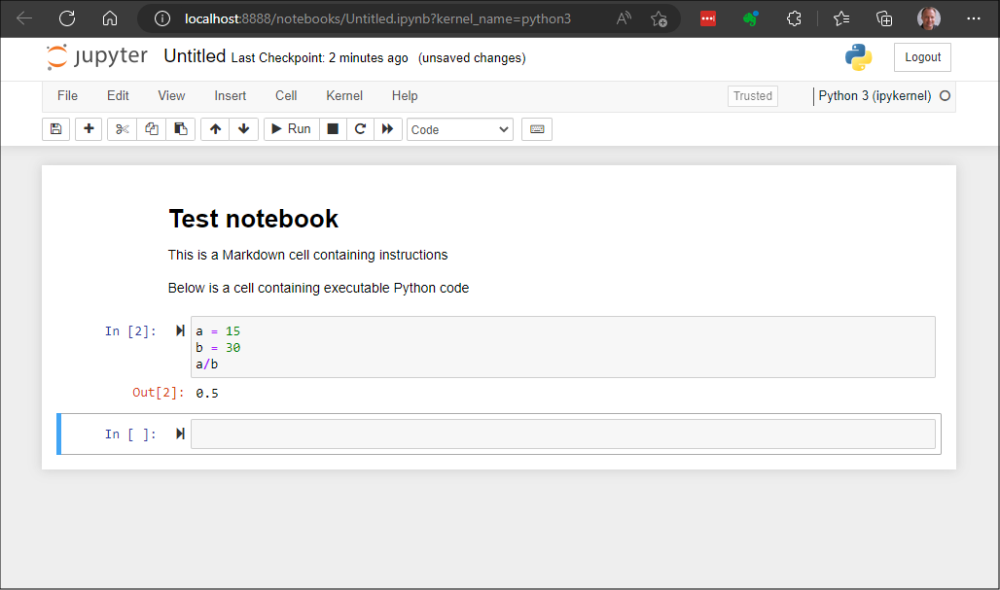

# Learning Data Science

This document outlines what I learned during my first first few weeks studying the tools associated with data science, such as databases, and Python frameworks like [SQLalchemy](https://www.sqlalchemy.org/), [Pandas](https://pandas.pydata.org/), and [Numpy](https://numpy.org/). 

Working with already-existing data stored in databases requires a significant amount of knowledge, so most data science books and blog avoid databases and work with simpler-to-use data sources like Excel files, CSV files, and text files. Instead of starting with these simpler examples, for which there are already [many](https://alongrandomwalk.com/2020/09/14/read-and-write-files-with-jupyter-notebooks/) [tutorials](https://www.digitalocean.com/community/tutorials/data-analysis-and-visualization-with-pandas-and-jupyter-notebook-in-python-3) [available](https://www.datacamp.com/tutorial/python-excel-tutorial), data scientists need to first learn how to [access data from a database](https://realpython.com/tutorials/databases/).

Unfortunately, most of the beginner-level information about databases that is available on books and online is targeted at application developers and describes how to create new databases that support applications. Available tutorials focus on designing and building an empty database that will store data and retrieve generated by an application.

But, data scientists usually need to read large amounts of data from already-existing databases. They need to study an already-existing database's schema so they can understand how to best analyze the data stored in it. They do not usually write data to the database or change its design.

This document's goal is to help a beginner to access and analyze data from an already-existing database.

# Learning materials

In this document, I am working through the examples provided in the book, *[Practical Data Science with Jupyter](https://nokia.percipio.com/books/f016a0a0-91bd-4ebf-852c-54f929f9f446)* by Prateek Gupta, published in 2021. The book is available in [Skillsoft Percipio](https://nokia.percipio.com/) so it is free for Nokians to read. It is concisely written and serves as a good book for beginners who want to learn how to use Python-related tools in data science.

However, it, and every other "Python for data science" book I looked at, does a very poor job covering how to use data stored in databases.

# Set up your environment

Many data scientists use [Jupyterlab](https://jupyter.org/) to develop and present their data science projects. This document uses JupyterLab as an advanced REPL that will run the Python code used to access data from a database and analyze it.

To use Jupyterlab, you must:

* Install Python on your Windows laptop
* Create a new folder for your data science learning projects
* Create a Python virtual environment and activate it
* Install JupyterLab in your virtual environment and run JupyterLab


## Install Python on your Windows laptop

There are many ways to [install Python on Windows](https://learn.microsoft.com/en-us/windows/python/beginners#install-python). I recommend installing it from the *Microsoft Store*. Open the Microsoft Store app and search for Python. Install the latest version. [Python 3.11](https://apps.microsoft.com/store/detail/python-311/9NRWMJP3717K?hl=en-ca&gl=ca&activetab=pivot%3Aoverviewtab&rtc=1) was the latest version at the time I wrote this notebook so all examples use Python 3.11.

## Create a new folder

Open the [Windows Terminal](https://apps.microsoft.com/store/detail/windows-terminal/9N0DX20HK701?hl=en-us&gl=us) app.

Create a new folder that will store your virtual environment, notebook files, and other files you create while learning about data science. Navigate to your home folder, or to a subdirectory of your choice and create a folder named *data-science*:

```powershell
> mkdir data-science
```

## Create a Python virtual environment

Navigate into the folder you created and create a Python virtual environment. I chose to call mine, *env*.

```powershell
> cd data-science
> python -m venv env
```

Next, activate the virtual environment.

```powershell
> .\env\Scripts\activate
(env) > 
```

## Install and run JupyterLab

Install JupyterLab in the virtual environment. JupyterLab installs a lot of modules so you should keep it in a virtual environment to avoid messing up your Windows system.

```powershell
(env) > pip install jupyterlab
```

Run JupyterLab.

```powershell
(env) > jupyter notebook
```

The terminal will show multiple URLs that you can copy and paste into a web browser. Because you installed JupyterLab in a virtual environment, use one of the *localhost* URLs, like the following

```
http://localhost:8888/?token=678b6891879b80fc02488701d553b1a2b4
```

The token is needed the first time you use a new browser to access JupyterLab. After using it once, it is cached in the browser and you can connect to JupyterLab in the future with just the simple URL: 

```
http://localhost:8888
```

The Jupyter Notebook web interface looks like the image below.



## Alternative interfaces

### Jupyter Lab

You can also use the JupyterLab interface, instead. If you want to open notebooks using the JupyterLab interface, start the Jupyter server with the following command, instead of using the `jupyter notebook` command:

```
(env) > jupyter-lab
```

JupyterLab is the newer interface and has more features but the original Notebook interface is all most people need.

### VS Code

Also, you can [edit Jupyter Notebooks in the VS Code editor](https://code.visualstudio.com/docs/datascience/jupyter-notebooks). Install the VSCode [Python extension]() and [Jupyter extension](https://marketplace.visualstudio.com/items?itemName=ms-toolsai.jupyter), then open the Notebook file in VS Code. The virtual environment must already be activated and the JupyterLab server must already be started.

# Get Data

To learn about the basics of data science, you need data. Eventually, you need to learn how to work with many sources of data, such as:

* Databases: mostly SQL databases
* Excel and CSV files stored on a secure SharePoint site
* APIs of external services
* Web scraping

While you work in the Analytics team, most of the data you will access will come from a database or a file on a secure SharePoint site. Most of our data comes from the HRDP data lake.

When you are at the beginning of your learning, it may be best to use a "dummy" database so you do not accidentally cause issues with a production database. 

## Data sources

If you cannot get access to HRDP when you start experimenting with data science tools like Python and SQLAlchemy, use another available database for practice. There is lots of data [available to the public](https://www.dropbase.io/post/top-11-open-and-public-data-sources) that you may want to analyze as you learn more about data science. We want to learn how to analyze data stored in a database so we need data available in that format.

The best solution is to install an SQL database engine like [SQLite](https://www.sqlite.org/index.html) on your PC and download a database backup from a public repository. [Kaggle](https://www.kaggle.com/) offers many [database files that are suitable for learning data science](https://www.kaggle.com/datasets?search=SQL) but you have to be careful. Many "databases" offered by Kaggle are poorly designed and cause errors when SQLAlchemy performs database reflection. Other, properly-designed databases like the [Northwind database](https://github.com/jpwhite3/northwind-SQLite3), or the [Chinook database](https://github.com/lerocha/chinook-database), may also be more suitable.

In this document, we will use the Chinook database from Kaggle. Clone the *[Chinook database repository](https://github.com/lerocha/chinook-database)* to your computer.

# Python and databases

We will focus on using Python instead of SQL, so we'll use an [Object Relational Mapper (ORM)](https://www.freecodecamp.org/news/what-is-an-orm-the-meaning-of-object-relational-mapping-database-tools/), instead of [SQL queries](https://www.postgresqltutorial.com/postgresql-tutorial/postgresql-select/). 

To work with an ORM and to integrate it with other frameworks like Pandas, you must learn more about advanced Python features such as [object-oriented programming](https://www.freecodecamp.org/news/object-oriented-programming-in-python/), [data classes](https://docs.python.org/3.11/library/dataclasses.html) and [type hints](https://towardsdatascience.com/type-hints-in-python-everything-you-need-to-know-in-5-minutes-24e0bad06d0b). This is a good opportunity to learn more about these topics.

## SQLite Database Engine

[SQLite](https://www.sqlite.org/index.html) is part of the Python standard library. It provides a file-based SQL database engine that does not require the programmer to install any additional Python packages. However, you need to know the SQL query language when writing programs that use the *sqlite* Python module.

In this document, we read data from the Formula 1 Race Data SQLite database file but we will use another Python package, *SQLAlchemy*, to read it instead of Python's built-in *sqlite* module.

## SQLAlchemy

[SQLAlchemy](https://www.sqlalchemy.org/) is a Python package that helps programmers interact with SQL databases, without having to learn the SQL Query language. If you use the SQLAlchemy package, which has a learning curve of its own, then your code will be independent from the [SQL language differences](https://towardsdatascience.com/how-to-find-your-way-through-the-different-types-of-sql-26e3d3c20aab) between the various SQL databases like MySQL, PostgreSQL, and Microsoft SQL Server.

We'll use SQLAlchemy's [Object Relational Mapper (ORM)](https://docs.sqlalchemy.org/en/20/orm/), instead of [SQLAlchemy Core](https://docs.sqlalchemy.org/en/20/core/).

### Install SQLALchemy

In your virtual environment, install SQLAchemy with the following command:

```powershell
(env) > pip install SQLAlchemy
```

# Connect to the database

Start a new Jupyter Notebook. In the first cell, enter the following code to prepare a connection to the database.

```python
from sqlalchemy import create_engine

engine = create_engine(r"sqlite:///C:/Users/blinklet/Documents/chinook-database/ChinookDatabase/DataSources/Chinook_Sqlite.sqlite")
```

Run the cell. The code will create an [engine](https://docs.sqlalchemy.org/en/20/core/engines_connections.html) object which represents a connection to the database specified in the URL passed to the *create_engine* function.

## Inspecting the database schema

Now that you connected to the database, you will want to study its structure. You may have some documentation that describes the database structure but, if not, you can learn about the database schema by using the [SQLAlchemy *inspect* module](https://docs.sqlalchemy.org/en/20/core/inspection.html#module-sqlalchemy.inspection).

Create a new cell in the notebook and enter the following code:

``` python
from sqlalchemy import inspect

inspector = inspect(engine)

print(inspector.get_table_names())
```

Run the cell. You created a new objected named *inspector* that contains You should see the output displayed as a list containing the table names in the Chinook database.

```python
['Album', 'Artist', 'Customer', 'Employee', 'Genre', 'Invoice', 'InvoiceLine', 'MediaType', 'Playlist', 'PlaylistTrack', 'Track']
```

You know the connection works because you were able to get the list of table names. Now, let's find out some more information about the database.

Since the inspect function outputs data as iterables, we will use Python's pretty print module, *pprint*, to display inspection results. Create a new cell and enter the following code: 


```python
from pprint import pprint

# Columns in table "Album"
pprint(inspector.get_columns("Album"))
print()

# Primary Key for table "Album"
pprint(inspector.get_pk_constraint("Album"))
```

When you run the code, you see that the *get_columns* method returns a list of dictionaries which contain information about each column in the table. "Album". The you see the *get_pk_constraint* method returns a dictionary containing a list of the table's primary keys.

The output should look like the listing below:

```
[{'autoincrement': 'auto',
  'default': None,
  'name': 'AlbumId',
  'nullable': False,
  'primary_key': 1,
  'type': INTEGER()},
 {'autoincrement': 'auto',
  'default': None,
  'name': 'Title',
  'nullable': False,
  'primary_key': 0,
  'type': NVARCHAR(length=160)},
 {'autoincrement': 'auto',
  'default': None,
  'name': 'ArtistId',
  'nullable': False,
  'primary_key': 0,
  'type': INTEGER()}]

{'constrained_columns': ['AlbumId'], 'name': None}
```

You can write a program that maps the tables, columns, and relationships in the database schema by iterating through the *inspection* object's attributes. Enter the code shown below into a new cell:

```python
for table_name in inspector.get_table_names():

    print(f"Table = {table_name}")
    
    print(f"Columns = ", end="")
    col_names_list = []
    for col in inspector.get_columns(table_name):
        col_names_list.append(col['name'])
    print(*col_names_list, sep=", ")
    
    print(f"Primary Keys = ", end="")
    pk_list = inspector.get_pk_constraint(table_name)
    pk_name_list = pk_list["constrained_columns"]
    print(*pk_name_list, sep=", ")

    fk_list = inspector.get_foreign_keys(table_name)
    if fk_list:
        print(f"Foreign Keys:")
        fk_name_list = []
        fk_reftbl_list = []
        fk_refcol_list = []
        
        for fk in fk_list:
            fk_name_list.append(*fk['constrained_columns'])
            fk_reftbl_list.append(fk['referred_table'])
            fk_refcol_list.append(*fk['referred_columns'])
            
        fk_info = zip(fk_name_list, fk_reftbl_list, fk_refcol_list)
        
        for n, t, c in fk_info:
            print(f"    {n} ---> {t}:{c}")

    print()
```

Run the cell. The output is a long list showing information about each table. We show a subset of the output, below, showing tables *PlaylistTrack* and *Track*:

```
Table = PlaylistTrack
Columns = PlaylistId, TrackId
Primary Keys = PlaylistId, TrackId
Foreign Keys:
    TrackId ---> Track:TrackId
    PlaylistId ---> Playlist:PlaylistId

Table = Track
Columns = Name, AlbumId, MediaTypeId, GenreId, Composer, Milliseconds, Bytes, UnitPrice, TrackId
Primary Keys = TrackId
Foreign Keys:
    MediaTypeId ---> MediaType:MediaTypeId
    GenreId ---> Genre:GenreId
    AlbumId ---> Album:AlbumId
```

In the listing above, you can [identify](https://condor.depaul.edu/gandrus/240IT/accesspages/relationships.htm) that the *PlaylistTrack* table is an [association table](https://docs.sqlalchemy.org/en/20/orm/basic_relationships.html#many-to-many) that supports a [many-to-many relationships](https://medium.com/@BryanFajardo/how-to-use-associative-entities-in-relational-databases-4456a2c71cda) between two other tables. A typical association table has two columns and each of its columns are both Primary Keys and Foreign Keys. Association tables are declared differently in the ORM than normal tables in the SQLAlchemy ORM. We'll cover more about that in the next section.

After looking at all the information output, you should be able to draw a diagram showing the database tables and relationships, like the one below:


# Build an SQLAlchemy model from an existing database

The process of automatically building new classes based on an existing database schema is called [reflection](https://betterprogramming.pub/reflecting-postgresql-databases-using-python-and-sqlalchemy-48b50870d40f). If you start with a properly designed database, you can map classes and relationships using the [SQLAlchemy Automap extension](https://docs.sqlalchemy.org/en/20/orm/extensions/automap.html). Database reflection is useful when writing simple, single-use scripts like the ones in this document.

Instead of using reflection, it is better to use [Declarative Mapping](https://docs.sqlalchemy.org/en/20/orm/declarative_mapping.html) to build SQLAlchemy ORM classes. It enables program maintainers to see the database information expressed in Python code. It also makes a program more robust, because you will be better able to predict the impact that changes in the database schema will have on your program. See *Appendix A* for more information. However, Declarative Mapping requires you to learn more about the ORM than we can cover in this document. So, we use reflection in our example.

To automatically generate an object model from the Chinook database, add a new cell to your Jupyter notebook, and enter the following code:

```python
from sqlalchemy.ext.automap import automap_base
from sqlalchemy.orm import Session

Base = automap_base()
Base.prepare(autoload_with=engine)

print(*Base.metadata.tables, sep=", ")
```

Run the cell. You used the *automap_base* function to create a [declarative base class](https://docs.sqlalchemy.org/en/20/orm/extensions/automap.html#basic-use) named *Base* and then used its *prepare* method to reflect the schema and produce mappings. You should see the output displayed below, showing the table names in the Chinook database.

```
Album, Artist, Customer, Employee, Genre, Invoice, InvoiceLine, Track, MediaType, Playlist, PlaylistTrack
```

You know the Base object now maps the database structure because you were able to get the list of table names from the metadata created in the new Base object.

The output is similar to what we saw when we used the *inspect* function, previously because *inspect* also uses reflection to get the database schema information.

## View the ORM classes

The reason programmers use the SQLAlchemy ORM is so that they can treat database tables like Python classes in their programs and work in the "Pythonic" way. Let's find out some more information about the mapped classes that reflect the tables in the database.

List the SQLAlchemy classes mapped by the automap extension.

```python
print(*Base.classes.keys(), sep=", ")
```

Run the cell. You should see the output displayed below, showing the table names in the Chinook database.

```
Album, Artist, Customer, Employee, Genre, Invoice, InvoiceLine, Track, MediaType, Playlist
```

If you compare the tables found using the *inspect* function and the *Base.metadata* object to the classes found in the *Base.classes* object, you will see that we have eleven tables but only ten classes. This is because the *PlaylistTrack* table is an association. SQLAlchemy ORM does not automatically create a class for an association table. It instead represents it as a table with foreign keys pointing to columns in the other tables.

## ORM Metadata

You can view more information about the tables declared in the ORM by parsing through the Base class's metadata. For example, the following code will print out table name, column names, primary keys, and foreign keys of any table.

```python
def table_info(table_name):
    table = Base.metadata.tables[table_name]
    print(f"Table: {table_name}")
    print(f"Columns: ")
    for col in table.columns:
        print(f"   {col.name:15}", end="")
        if col.primary_key:
            print(f"*Primary Key*   ", end="")
        if col.foreign_keys:
            print(f"{col.foreign_keys}", end="")
        print()
    print()
```

Call the *table_info()* function, as shown below:

```python
table_info("PlaylistTrack")
table_info("Track")
```

You should see the two tables described, with each table's output looking like the below text:

```
Table: PlaylistTrack
Columns: 
   PlaylistId     *Primary Key*   {ForeignKey('Playlist.PlaylistId')}
   TrackId        *Primary Key*   {ForeignKey('Track.TrackId')}

Table: Track
Columns: 
   TrackId        *Primary Key*   
   Name           
   AlbumId        {ForeignKey('Album.AlbumId')}
   MediaTypeId    {ForeignKey('MediaType.MediaTypeId')}
   GenreId        {ForeignKey('Genre.GenreId')}
   Composer       
   Milliseconds   
   Bytes          
   UnitPrice 
```

<!--change-->

Again, you can see that the *PlaylistTrack* table is an association table. Remember that association tables are not reflected as classes so there will be no *PlaylistTrack* class in the ORM. But, the association table appears in the metadata.

## Assign table classes

So that you can more easily use the reflected tables, assign each SQLAlchemy ORM class to a variable so it is easier to work with. Create a new Jupyter Notebook cell and run the following code:

```python
Album = Base.classes.Album
Artist = Base.classes.Artist
Customer = Base.classes.Customer
Employee = Base.classes.Employee
Genre = Base.classes.Genre
Invoice = Base.classes.Invoice
InvoiceLine = Base.classes.InvoiceLine
MediaType = Base.classes.MediaType
Playlist = Base.classes.Playlist
Track = Base.classes.Track
playlisttrack = Base.metadata.tables['PlaylistTrack']
```

# Get data from the database

Up until now, we've been playing with the information you can get about the database schema and how to define the ORM's declarative base object automatically when working with an existing database. Next, we need to get data out of that database so we can analyze it.

In this example, we will use the [Pandas framework](https://pandas.pydata.org/) to get data from the database. You can also query the database using SQLAlchemy but, since we will use Pandas to analyze data, we will also use it to query data.

## Install Pandas

First, install the Pandas Python package. Go to the terminal window that is running your virtual environment and enter the commands:

```powershell
(env) > pip install pandas
```

When Pandas is installed, [Numpy](https://numpy.org/) will also be installed because Pandas uses Numpy.

## Query data and convert into Pandas dataframes

Create an SQLAlchemy query and load its results into a Pandas dataframe. First, simply open a [session](https://docs.sqlalchemy.org/en/20/orm/session_basics.html) abd ask for all data from one table.

Create a new cell in your Jupyter Notebook and run the following code:

```python
import pandas as pd

session1 = Session(engine)

df = pd.read_sql_table(table_name='Album', con=engine)

print(df)
```

The output looks like below. 

```
     AlbumId                                              Title  ArtistId
0          1              For Those About To Rock We Salute You         1
1          2                                  Balls to the Wall         2
2          3                                  Restless and Wild         2
3          4                                  Let There Be Rock         1
4          5                                           Big Ones         3
..       ...                                                ...       ...
342      343                             Respighi:Pines of Rome       226
343      344  Schubert: The Late String Quartets & String Qu...       272
344      345                                Monteverdi: L'Orfeo       273
345      346                              Mozart: Chamber Music       274
346      347  Koyaanisqatsi (Soundtrack from the Motion Pict...       275

[347 rows x 3 columns]
```

The output shows that Pandas successfully [queried the database](https://docs.sqlalchemy.org/en/20/orm/queryguide/index.html) and saved the query results in a dataframe. Pandas automatically truncates the output if the number of rows or columns exceeds the default length. You can see the default length by executing the following code:

```python
print(pd.options.display.max_rows)
print(pd.options.display.max_columns)
```

You will see the default maximum number of rows that can be viewed is 60 and the default maximum number of columns that can be viewed is 20.

## Joining datafames

To get more interesting data sets, we need to join database tables. To keep the output readable, use the Pandas dataframe head() method, which outputs only the first 5 rows of the dataframe.

```python
df2 = pd.read_sql_table(table_name='Artist', con=engine)

print(df2.head())
```

```
   ArtistId               Name
0         1              AC/DC
1         2             Accept
2         3          Aerosmith
3         4  Alanis Morissette
4         5    Alice In Chains
```

I want to create a dataframe that lists the full artist name associated with every album

```python
mdf = pd.merge(left = df, right = df2, how = 'inner')
print(mdf.head())
print(mdf.shape)
```

I used the Pandas dataframe *shape* attribute to check the number of rows and columns in the dataframe, since I am only displaying the first five rows.

```
   AlbumId                                  Title  ArtistId       Name
0        1  For Those About To Rock We Salute You         1      AC/DC
1        4                      Let There Be Rock         1      AC/DC
2        2                      Balls to the Wall         2     Accept
3        3                      Restless and Wild         2     Accept
4        5                               Big Ones         3  Aerosmith
(347, 4)
```

It would be better to remove the "ArtistId" column from the data frame because it is now redundant.

```python

x = pd.merge(df, df2)
x = x.drop('ArtistId', axis=1)
x = x.rename(columns = {'Name':'Artist'})
print(x.head())
print(x.shape)
```
```
   AlbumId                                  Title     Artist
0        1  For Those About To Rock We Salute You      AC/DC
1        4                      Let There Be Rock      AC/DC
2        2                      Balls to the Wall     Accept
3        3                      Restless and Wild     Accept
4        5                               Big Ones  Aerosmith
(347, 3)
```


# Appendix A: Generate Declarative Mapping

Instead of using reflection and automap to get metadata from an existing database and automatically build the ORM, use the *[sqlacodegen](https://github.com/agronholm/sqlacodegen)* tool. It reads the structure of an existing database and generates the appropriate SQLAlchemy model code. You can then copy and paste that code into a python module and use it in your program.

Install sqlacodegen in your virtual environment. At the time I wrote this document, the stable version of sqlacodegen was not compatible with Python 3.11. I installed the pre-release version so it would work with Python 3.11.

```powershell
> pip install --pre sqlacodegen
```

Then, run the sqlacodegen tool against the Chinook database.

```powershell
sqlacodegen sqlite:///C:\Users\\brian\\Documents\\chinook-database\\ChinookDatabase\\DataSources\\Chinook_Sqlite.sqlite > declare_db.py
```

This creates a file named *declare_db.py* that has the following contents that builds ORM classes and tables for the Chinook database:

```python
from sqlalchemy import Column, DateTime, ForeignKey, Index, Integer, NVARCHAR, Numeric, Table
from sqlalchemy.orm import declarative_base, relationship

Base = declarative_base()
metadata = Base.metadata


class Artist(Base):
    __tablename__ = 'Artist'

    ArtistId = Column(Integer, primary_key=True)
    Name = Column(NVARCHAR(120))

    Album = relationship('Album', back_populates='Artist_')


class Employee(Base):
    __tablename__ = 'Employee'
    __table_args__ = (
        Index('IFK_EmployeeReportsTo', 'ReportsTo'),
    )

    EmployeeId = Column(Integer, primary_key=True)
    LastName = Column(NVARCHAR(20), nullable=False)
    FirstName = Column(NVARCHAR(20), nullable=False)
    Title = Column(NVARCHAR(30))
    ReportsTo = Column(ForeignKey('Employee.EmployeeId'))
    BirthDate = Column(DateTime)
    HireDate = Column(DateTime)
    Address = Column(NVARCHAR(70))
    City = Column(NVARCHAR(40))
    State = Column(NVARCHAR(40))
    Country = Column(NVARCHAR(40))
    PostalCode = Column(NVARCHAR(10))
    Phone = Column(NVARCHAR(24))
    Fax = Column(NVARCHAR(24))
    Email = Column(NVARCHAR(60))

    Employee = relationship('Employee', remote_side=[EmployeeId], back_populates='Employee_reverse')
    Employee_reverse = relationship('Employee', remote_side=[ReportsTo], back_populates='Employee')
    Customer = relationship('Customer', back_populates='Employee_')


class Genre(Base):
    __tablename__ = 'Genre'

    GenreId = Column(Integer, primary_key=True)
    Name = Column(NVARCHAR(120))

    Track = relationship('Track', back_populates='Genre_')


class MediaType(Base):
    __tablename__ = 'MediaType'

    MediaTypeId = Column(Integer, primary_key=True)
    Name = Column(NVARCHAR(120))

    Track = relationship('Track', back_populates='MediaType_')


class Playlist(Base):
    __tablename__ = 'Playlist'

    PlaylistId = Column(Integer, primary_key=True)
    Name = Column(NVARCHAR(120))

    Track = relationship('Track', secondary='PlaylistTrack', back_populates='Playlist_')


class Album(Base):
    __tablename__ = 'Album'
    __table_args__ = (
        Index('IFK_AlbumArtistId', 'ArtistId'),
    )

    AlbumId = Column(Integer, primary_key=True)
    Title = Column(NVARCHAR(160), nullable=False)
    ArtistId = Column(ForeignKey('Artist.ArtistId'), nullable=False)

    Artist_ = relationship('Artist', back_populates='Album')
    Track = relationship('Track', back_populates='Album_')


class Customer(Base):
    __tablename__ = 'Customer'
    __table_args__ = (
        Index('IFK_CustomerSupportRepId', 'SupportRepId'),
    )

    CustomerId = Column(Integer, primary_key=True)
    FirstName = Column(NVARCHAR(40), nullable=False)
    LastName = Column(NVARCHAR(20), nullable=False)
    Email = Column(NVARCHAR(60), nullable=False)
    Company = Column(NVARCHAR(80))
    Address = Column(NVARCHAR(70))
    City = Column(NVARCHAR(40))
    State = Column(NVARCHAR(40))
    Country = Column(NVARCHAR(40))
    PostalCode = Column(NVARCHAR(10))
    Phone = Column(NVARCHAR(24))
    Fax = Column(NVARCHAR(24))
    SupportRepId = Column(ForeignKey('Employee.EmployeeId'))

    Employee_ = relationship('Employee', back_populates='Customer')
    Invoice = relationship('Invoice', back_populates='Customer_')


class Invoice(Base):
    __tablename__ = 'Invoice'
    __table_args__ = (
        Index('IFK_InvoiceCustomerId', 'CustomerId'),
    )

    InvoiceId = Column(Integer, primary_key=True)
    CustomerId = Column(ForeignKey('Customer.CustomerId'), nullable=False)
    InvoiceDate = Column(DateTime, nullable=False)
    Total = Column(Numeric(10, 2), nullable=False)
    BillingAddress = Column(NVARCHAR(70))
    BillingCity = Column(NVARCHAR(40))
    BillingState = Column(NVARCHAR(40))
    BillingCountry = Column(NVARCHAR(40))
    BillingPostalCode = Column(NVARCHAR(10))

    Customer_ = relationship('Customer', back_populates='Invoice')
    InvoiceLine = relationship('InvoiceLine', back_populates='Invoice_')


class Track(Base):
    __tablename__ = 'Track'
    __table_args__ = (
        Index('IFK_TrackAlbumId', 'AlbumId'),
        Index('IFK_TrackGenreId', 'GenreId'),
        Index('IFK_TrackMediaTypeId', 'MediaTypeId')
    )

    TrackId = Column(Integer, primary_key=True)
    Name = Column(NVARCHAR(200), nullable=False)
    MediaTypeId = Column(ForeignKey('MediaType.MediaTypeId'), nullable=False)
    Milliseconds = Column(Integer, nullable=False)
    UnitPrice = Column(Numeric(10, 2), nullable=False)
    AlbumId = Column(ForeignKey('Album.AlbumId'))
    GenreId = Column(ForeignKey('Genre.GenreId'))
    Composer = Column(NVARCHAR(220))
    Bytes = Column(Integer)

    Playlist_ = relationship('Playlist', secondary='PlaylistTrack', back_populates='Track')
    Album_ = relationship('Album', back_populates='Track')
    Genre_ = relationship('Genre', back_populates='Track')
    MediaType_ = relationship('MediaType', back_populates='Track')
    InvoiceLine = relationship('InvoiceLine', back_populates='Track_')


class InvoiceLine(Base):
    __tablename__ = 'InvoiceLine'
    __table_args__ = (
        Index('IFK_InvoiceLineInvoiceId', 'InvoiceId'),
        Index('IFK_InvoiceLineTrackId', 'TrackId')
    )

    InvoiceLineId = Column(Integer, primary_key=True)
    InvoiceId = Column(ForeignKey('Invoice.InvoiceId'), nullable=False)
    TrackId = Column(ForeignKey('Track.TrackId'), nullable=False)
    UnitPrice = Column(Numeric(10, 2), nullable=False)
    Quantity = Column(Integer, nullable=False)

    Invoice_ = relationship('Invoice', back_populates='InvoiceLine')
    Track_ = relationship('Track', back_populates='InvoiceLine')


t_PlaylistTrack = Table(
    'PlaylistTrack', metadata,
    Column('PlaylistId', ForeignKey('Playlist.PlaylistId'), primary_key=True, nullable=False),
    Column('TrackId', ForeignKey('Track.TrackId'), primary_key=True, nullable=False),
    Index('IFK_PlaylistTrackTrackId', 'TrackId')
)
```

You can see how declarative mapping shows you everything you need to know about the database structure so you can use it in your program. 