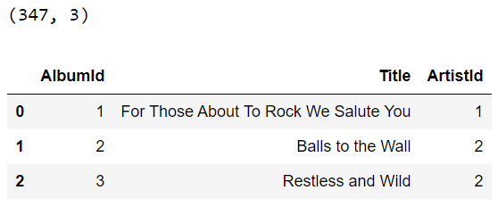
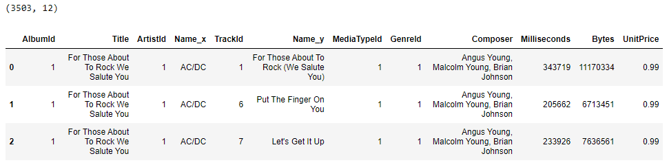
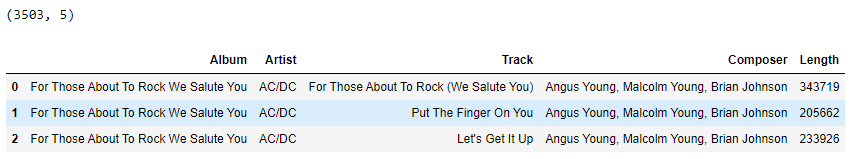
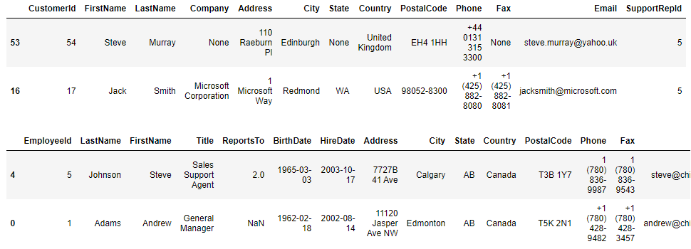
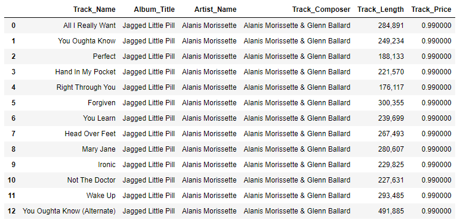

% Reading database tables into pandas dataframes

Most [Pandas](https://pandas.pydata.org/) books and blogs do not show you how to get data stored in databases. Instead, they work with simpler-to-use data sources like [CSV files](https://en.wikipedia.org/wiki/Comma-separated_values). There are already [many](https://alongrandomwalk.com/2020/09/14/read-and-write-files-with-jupyter-notebooks/) [tutorials](https://www.digitalocean.com/community/tutorials/data-analysis-and-visualization-with-pandas-and-jupyter-notebook-in-python-3) [available](https://www.datacamp.com/tutorial/python-excel-tutorial) for these simpler examples.

This document will show you how to read data from a database and load it into Pandas dataframes for further analysis. This document does not go into details about handling and analyzing data after you get it from the database. While you will see lots of examples in this document, they do not represent a comprehensive set of Pandas functions.

# Python, pandas, and databases

Python programmers who use Pandas to perform data analysis have many options for gathering data and incorporating it into their programs. Pandas users may get data from SQL databases using Pandas functions, a database driver combined with SQL queries, or by using an [object-relational mapping (ORM) framework](https://en.wikipedia.org/wiki/Object%E2%80%93relational_mapping), or some combination of these tools.

Programmers who do not know SQL can use Pandas to read individual SQL database tables into Pandas dataframes. Then, they can use Pandas to join, transform, and filter those dataframes until they create the dataset that they need.

Python programmers who are already proficient in writing [SQL queries](https://www.postgresqltutorial.com/postgresql-tutorial/postgresql-select/) may use them in Pandas to read a complex dataset into a Pandas dataframe. Or, they may directly access the data by passing their SQL queries to an SQL database driver. [^1]

[^1]: Use the appropriate driver that is compatible with the SQL database you are using, such as [psycopg](https://www.psycopg.org/) for PostgreSQL, or [mysql-connector-python](https://dev.mysql.com/doc/connector-python/en/) for MySQL. Since we are using an SQLite database, we could use the [sqlite package](https://www.sqlite.org/index.html), which is part of the Python standard library.

Finally, Python programmers who do not know SQL but who still want to build powerful SQL queries in Python programs may use the [SQLAlchemy ORM](https://www.sqlalchemy.org/SQLAlchemy). It can be used to create queries for Pandas functions or to select data directly from the database. I will discuss SQLAlchemy in another document.

# Set up your environment

Before you start working through this tutorial, set up your database server and install Python on your laptop. Then, start a Python virtual environment and install Jupyter notebooks and Pandas in it.

## Set up your database

You do not need to install a database server because we will use an SQLite database. We chose to use the SQLite database engine to serve the database in this tutorial because SQLite is the most widely used SQL database and because we do not need to install and configure a separate SQL server. SQLite is a file-based database and the SQLite database driver is built into the Python standard library.

## Install Python on your Windows laptop

Start by installing Python on your laptop. Go to the [Python web page](https://www.python.org/) for the most up-to-date information about installing python on your operating system.

[Install Python on Windows](https://learn.microsoft.com/en-us/windows/python/beginners#install-python) from the *Microsoft Store*. Open the Microsoft Store app and search for Python. Install the latest version. [Python 3.11](https://apps.microsoft.com/store/detail/python-311/9NRWMJP3717K?hl=en-ca&gl=ca&activetab=pivot%3Aoverviewtab&rtc=1) was the latest version at the time I wrote this notebook so all examples use Python 3.11.

## Install Pandas

[Pandas](https://pandas.pydata.org/pandas-docs/stable/index.html) is a Python package that makes working with relational or labeled data both easy and intuitive. It aims to be the fundamental high-level building block for doing practical, real-world data analysis in Python. [^2]

[^2]: From the [Pandas package overview documentation](https://pandas.pydata.org/pandas-docs/stable/getting_started/overview.html), accessed on March 17, 2023]

To install Pandas:

* Create a new folder for your data science learning projects
* Create a Python virtual environment and activate it
* Install Pandas in your virtual environment

Open the [Windows Terminal](https://apps.microsoft.com/store/detail/windows-terminal/9N0DX20HK701?hl=en-us&gl=us) app.

Create a new folder that will store your virtual environment and the files you create while learning about data science. Navigate to your home folder, or to a subdirectory of your choice and create a folder named *data-science*:

```powershell
> mkdir data-science
```

Navigate into the folder you created and create a Python virtual environment. I chose to call mine *env*.

```powershell
> cd data-science
> python -m venv env
```

Next, activate the virtual environment.

```powershell
> .\env\Scripts\activate
(env) > 
```

In the virtual environment, install the Pandas Python package and supporting packages for converting Pandas dataframes to Microsoft Excel spreadsheets. Go to the terminal window that is running your virtual environment and enter the commands:

```powershell
(env) > pip install pandas
(env) > pip install openpyxl xlsxwriter xlrd
```

When Pandas is installed, [NumPy](https://numpy.org/) will also be installed NumPy (Numerical Python) is an open source Python library that’s used for working with numerical data in Python.

### New frameworks

While Pandas and NumPy are the current standard for data analytics in Python, some new projects are on the horizon that claim to be more modern and efficient. [Apache Arrow](https://arrow.apache.org/) could be used in place of NumPy and [Polars](https://www.pola.rs/) could be used in place of Pandas. For now, we will use Pandas, which uses Numpy.

## Install Jupyter Notebooks

You may, optionally, install [Jupyter](https://jupyter.org/). Many data scientists use Jupyter notebooks as a development environment and to present their results.

This document uses a Jupyter Notebook as an advanced [REPL](https://codewith.mu/en/tutorials/1.0/repl) that makes it easier to demonstrate the Python code used to access data from a database and display the results. If you prefer to use a simple text editor or another REPL, you can still follow along with this tutorial.

Install JupyterLab in your Python virtual environment. 

```powershell
(env) > pip install jupyterlab
```

Run JupyterLab.

```powershell
(env) > jupyter notebook
```

The terminal will show multiple URLs that you can copy and paste into a web browser. Because you installed JupyterLab in a virtual environment, use one of the *localhost* URLs, like the following

```
http://localhost:8888/?token=678b6891879b80fc02488701d553b1a2b4
```

The token is needed the first time you use a new browser to access JupyterLab. After using it once, it is cached in the browser and you can connect to JupyterLab in the future with just the simple URL: 

```
http://localhost:8888
```

The Jupyter Notebook web interface looks like the image below.


When following along with the code examples in this document, open a new notebook cell for each example, enter the code, and run it. the results of code run in previous cells in held in memory and is available to subsequent cells. For example, a dataframe created in one cell can be used in a later cell.

### Alternative Jupyter interfaces

JupyterLab is the newer interface for Jupyter Notebooks and has more features.  If you want to open notebooks using the JupyterLab interface, start the Jupyter server with the following command, instead of using the `jupyter notebook` command. 

```
(env) > jupyter-lab
```

Also, you can [edit Jupyter Notebooks in the VS Code editor](https://code.visualstudio.com/docs/datascience/jupyter-notebooks). Install the VSCode [Python extension](https://code.visualstudio.com/docs/languages/python) and [Jupyter extension](https://marketplace.visualstudio.com/items?itemName=ms-toolsai.jupyter), then open the Notebook file in VS Code. The virtual environment must already be activated and the JupyterLab server must already be started.

# Data sources

To practice the basics of data science, you need data. Eventually, you need to learn how to work with many sources of data, such as:

* Databases such as SQL databases
* Excel and CSV files stored on a secure SharePoint site
* APIs of external services
* Web scraping

While you work in the Analytics team, most of the data you will access will come from a database or a file on a secure SharePoint site. Most of our data comes from the HRDP database.

When you are at the beginning of your learning, it may be best to practice on a "dummy" database so you do not accidentally cause issues with a production database. 

## Available public databases

You can find data sets that are [available to the public](https://www.dropbase.io/post/top-11-open-and-public-data-sources) but very few of them run on database servers. We want to learn how to analyze data stored in a database so we need data available in that format.

The best solution is to install an SQL database engine like [SQLite](https://www.sqlite.org/index.html) on your PC and download a database backup from a public repository. In this document, we will use the *[Chinook database](https://github.com/lerocha/chinook-database)*, which is a public database that tries to emulate a media store's database. It contains customer names and addresses, sales data, and inventory data.

[Download the *Chinook_Sqlite.sqlite* file](https://github.com/lerocha/chinook-database/blob/master/ChinookDatabase/DataSources/Chinook_Sqlite.sqlite) from the Chinook Database project's [downloads folder]() and save it to your computer.

# Read database tables into Pandas dataframes

You may encounter a "chicken and egg" situation where you want to use Pandas to read SQL tables into dataframes but you do not know enough about the database schema to proceed. At a minimum, you need to know the database table names. 

It is best to find the database documentation, if it is available. If not, you can research the SQL statement that will list the database table names. The statement syntax is different for different databases. For a SQLite database, the command is:

```python
statement = 'SELECT name FROM sqlite_master WHERE type= "table"'

tables = pd.read_sql_query(statement, url)
print(tables)
```

We will cover the Pandas *read_sql_query()* function later in this chapter.


## The *read_sql_table* function

Developers who want to use Pandas to read data from the SQL database into Pandas dataframes may use the Pandas [*read_sql_table()* function](https://pandas.pydata.org/pandas-docs/stable/reference/api/pandas.read_sql_table.html). To use the function, simply pass it the name of the table in the database and the URL of the database.

Pandas does the work of creating a connection to the database, reading all the columns in the table, exporting them into a Pandas dataframe, and returning the dataframe. For example, we will read the contents of the *Album* table from the Chinook database we previously downloaded and display the first few lines.

```python
import pandas as pd

url = r"sqlite:///C:/Users/blinklet/Documents/Chinook_Sqlite.sqlite"

albums = pd.read_sql_table('Album', url)

print(df.shape)
display(df.head(3))
```

Since we are using a Jupyter Notebook, we can use the [*display* function](https://datascientyst.com/style-pandas-dataframe-like-pro-examples/) to output a [styled table](https://pandas.pydata.org/pandas-docs/stable/user_guide/style.html) that is more readable. The output looks like below:

{width=60%}

You can read multiple tables into different dataframes to build up a set of data to analyze. Get the contents of the *Artist* and *Track* table:

```python
artists = pd.read_sql_table('Artist', url)
tracks = pd.read_sql_table('Track', url)
```

## Joining dataframes in Pandas

To get more interesting data sets, we need to [join database tables](https://learnsql.com/blog/how-to-join-tables-sql/). For now, we will accomplish this by reading different tables into Pandas dataframes and [merging the dataframes](https://pandas.pydata.org/pandas-docs/stable/user_guide/merging.html). 


If you look at the columns in the dataframes you created, you see that there may be a relationship between each of the tables that you read into dataframes. Print the output of each dataframes *columns* attribute:

```python
print(albums.columns)
print(artists.columns)
print(tracks.columns)
```

the output shows the columns names in each dataframe

```
albums columns:  Index(['AlbumId', 'Title', 'ArtistId'], dtype='object')

artists columns:  Index(['ArtistId', 'Name'], dtype='object')

tracks columns:  Index(['TrackId', 'Name', 'AlbumId', 'MediaTypeId', 'GenreId', 'Composer', 'Milliseconds', 'Bytes', 'UnitPrice'], dtype='object')
```

You see that the *AlbumId* column in the *albums* dataframe matches with the *AlbumId* column in the *tracks* dataframe. The *ArtistId* column in the *albums* dataframe matches with the ArtistId in the *artists* dataframe.

### Merging dataframes

I want to create a dataframe that lists the full artist name associated with every album. So, I will [merge](https://pandas.pydata.org/pandas-docs/stable/user_guide/merging.html#database-style-dataframe-or-named-series-joining-merging) the dataframe *albums* and the dataframe *artists* into a new dataframe named *df1*. By default, the [pandas merge method](https://pandas.pydata.org/pandas-docs/stable/reference/api/pandas.merge.html) operates like an [*inner join*](https://pandas.pydata.org/pandas-docs/stable/user_guide/merging.html#database-style-dataframe-or-named-series-joining-merging) operation so it returns merged rows that match between the left and right side of the join.

You can join two dataframes together using the Pandas *merge()* function, or you can join any number of dataframes together using each dataframe's *merge()* method. 

For example, to merge the albums and artists dataframes, use the following code:

```python
df1 = pd.merge(left = albums, right = artists)
print(df1.shape)
print(df1.head())
```

I used the Pandas dataframe *shape* attribute to check the number of rows and columns in the dataframe, since I am only displaying the first five rows.

```
(347, 4)
   AlbumId                                  Title  ArtistId       Name
0        1  For Those About To Rock We Salute You         1      AC/DC
1        4                      Let There Be Rock         1      AC/DC
2        2                      Balls to the Wall         2     Accept
3        3                      Restless and Wild         2     Accept
4        5                               Big Ones         3  Aerosmith
```

Pandas does not know about the relationships between the tables in the database. It assumes that the inner join will be performed by matching columns from each dataframe that have the same name. If you need to join on columns that do not have the same names, you can specify which columns to join on in the Pandas *merge()* function's parameters.


### Merging multiple dataframes

Pandas dataframes have a [*merge()* method](https://www.w3schools.com/python/pandas/ref_df_merge.asp) that works the same as the Pandas *merge()* function with the calling dataFrame being considered the left side in the join.

You can chain multiple *merge()* methods together to join multiple dataframes in one statement. But you have to be careful about overwriting columns that have the same name. In this case, the dataframes have more than one columns with the same names and it confuses Pandas. So, specify the column that each merge should match on.

```python
df1 = albums.merge(artists, on='ArtistId').merge(tracks, on='AlbumId')

print(df1.shape)
display(df1.head(3))
```



You can see we had two columns with the column name *Name* that were automatically renamed by Pandas to prevent confusion. By default, Pandas uses the "_x" and "_y" suffixes to rename merged columns with the same name. If you want to use other suffixes, you can specify them as parameters when you call the *merge()* method.

```python
df1 = (
    albums
    .merge(artists, on='ArtistId')
    .merge(tracks, on='AlbumId', suffixes=['_artist','_album'])
)
print(df1.shape)
display(df1.head(3))
```

You specified the suffixes in the second *merge()* method because that is where you expect to encounter two columns with the same name, "Name".

You can keep chaining Pandas dataframe methods to create complex operations that merge dataframes, rename and delete columns, and more. For example:

```python
df1 = (
    albums
    .merge(artists, on='ArtistId')
    .merge(tracks, on='AlbumId', suffixes=['_artist','_track'])
    .rename(columns = {'Title':'Album','Name_artist':'Artist', 
                       'Name_track':'Track', 'Milliseconds':'Length',})
    .drop(['AlbumId', 'TrackId', 'MediaTypeId', 
           'GenreId', 'Bytes', 'UnitPrice', 'ArtistId'], axis=1)
)

print(df1.shape)
display(df1.head(3))
```

Which displays the following output:



Now you have a dataframe that has 3,503 rows. Each row contains  information about a track's album, artists, composer, and length.


### Merging dataframes with outer joins

When merging dataframes, you may want to include rows from one or both dataframes that do not match on the defined columns in each dataframe. This is called at [*outer join*](https://www.freecodecamp.org/news/sql-join-types-inner-join-vs-outer-join-example/).

For example, imagine that we need to create a dataframe that shows the number of customers supported by each employee. 

Consider the Employee and Customer tables in the Chinook database.  

```python
customers = pd.read_sql_table('Customer', url)
employees = pd.read_sql_table('Employee', url)

print(f"customers columns:  {customers.columns}\n")
print(f"employees columns:  {employees.columns}")
```

You see the column names of each dataframe, below:

```
customers columns:  Index(['CustomerId', 'FirstName', 'LastName', 'Company', 'Address', 'City', 'State', 'Country', 'PostalCode', 'Phone', 'Fax', 'Email', 'SupportRepId'], dtype='object')

employees columns:  Index(['EmployeeId', 'LastName', 'FirstName', 'Title', 'ReportsTo', 'BirthDate', 'HireDate', 'Address', 'City', 'State', 'Country', 'PostalCode', 'Phone', 'Fax', 'Email'], dtype='object')
``` 

There are no column names that suggest they might provide a match between the two tables. If you were accessing the data using an SQL client or an ORM, you could see the relationship between the two database tables. But, unless they are documented, you cannot so easily determine the relationships between Pandas dataframes.

You may be able to figure out the relationships between two dataframes you want to merge. To find potential matches, display a few rows of each dataframe.

```python
display(customers.sample(2))
display(employees.sample(2))
```

You can see in the output that the ID numbers in the *customers* dataframe's SupportRepId column match the ID numbers *employees* dataframe's EmployeeId column to create a many-to-one relationship between the *customers* and *employees* dataframes.



A merge statement that [executes an outer join](https://pandas.pydata.org/pandas-docs/stable/user_guide/merging.html#brief-primer-on-merge-methods-relational-algebra) of the *customers* and *employees* dataframes is shown below.

```python
df2 = pd.merge(
    employees, 
    customers, 
    left_on='EmployeeId', 
    right_on='SupportRepId',
    suffixes=['_emp','_cust'],
    how = 'outer'
)
```

Now, you can analyze the merged data. 

The following code merges the *customers* and *employees* dataframes, adds appropriate suffixes to overlapping table names, and groups employees according to the number of customers each supports.

```python
df2 = (
    df2
    .groupby(['EmployeeId','LastName_emp', 
              'FirstName_emp', 'Title'], 
             as_index=False, dropna=False)['CustomerId']
    .count()
    .rename(columns = {'CustomerId':'Num_Customers'})
)
```

From the grouped dataframe, combine the employee name columns into one and re-orders the columns in the dataframe so the presentation is clear.

```python
df2['Employee_Name'] = (
    df2['FirstName_emp'] + ' ' + df2['LastName_emp']
)

df2 = df2.drop(['FirstName_emp', 'LastName_emp'], axis=1)

df2 = df2[['EmployeeId', 'Employee_Name', 'Title', 'Num_Customers']]

print(df2.to_string(index=False))
```

We see the following output:

```
 EmployeeId    Employee_Name               Title  Num_Customers
          1     Andrew Adams     General Manager              0
          2    Nancy Edwards       Sales Manager              0
          3     Jane Peacock Sales Support Agent             21
          4    Margaret Park Sales Support Agent             20
          5    Steve Johnson Sales Support Agent             18
          6 Michael Mitchell          IT Manager              0
          7      Robert King            IT Staff              0
          8   Laura Callahan            IT Staff              0
```

Now all the employees records are in the dataframe that was grouped so we see that five employees supported no customers. This makes sense when you look at the employees' titles.

## The *read_sql_query* function

When working with large amounts of data, you may prefer to perform most of your data join, grouping, and filter operations on the database server instead of locally on your PC. The Pandas *read_sql_query* enables you to send an SQL query to the database and then load the selected data into a dataframe.

### Selecting data

To select data from the SQL database, you need to create an SQL query statement using the [SQL language](https://en.wikipedia.org/wiki/SQL). For example, see the SQL statement below that selects all the columns in a table:

```sql
SELECT * FROM Album
```

To use that statement with Pandas, run the following code:

```python
statement = "SELECT * FROM Album"

albums = pd.read_sql_query(statement, url)
print(albums.shape)
print(albums.sample(4))
```

The output shows a random sample of four rows from the *albums* dataframe, which contains the entire contents, 347 rows, of the *Album* table.

```
(347, 3)
     AlbumId                        Title  ArtistId
78        79       In Your Honor [Disc 1]        84
23        24               Afrociberdelia        18
195      196  Retrospective I (1974-1980)       128
218      219                     Tangents       143
```

### Filtering data

One of the benefits of using SQL queries is that you can select a subset of data to read into your dataframe. This is more efficient than reading in all the data from a table and then using Pandas to remove data you don't need.

For example, if you only need a list four random Album titles from the Album table, select only data from the Title column and limit the number of returned rows to four:

```python
statement = """
SELECT "Album"."Title" 
FROM Album 
ORDER BY random()
LIMIT 4
"""

albums = pd.read_sql_query(statement, url)
print(albums.shape)
print(albums)
```

The output shows that the *albums* dataframe now contains only four rows of album titles so we do not need to perform any additional Pandas operations to reduce the data to only what we need.

```
(4, 1)
                                       Title
0  Beethoven: Symphony No. 6 'Pastoral' Etc.
1                           Live After Death
2                               Supernatural
3            Vinícius De Moraes - Sem Limite
```

### Joining tables into one dataframe

Another benefit of SQL is that, when working with large databases, you can join tables and clean data more efficiently on the SQL server because it is optimized for these kinds of operations.

SQL query statements can select specific columns from tables, filter returned rows based on your criteria, join tables, rename columns, and more. For example, the query below merges data from the Album, Artist, and Track tables and then returns only the tracks performed by the artist named "Alanis Morissette":

```python
statement = """
SELECT "Track"."Name" AS "Track_Name", 
    "Album"."Title" AS "Album_Title", 
    "Artist"."Name" AS "Artist_Name", 
    "Track"."Composer" AS "Track_Composer", 
    "Track"."Milliseconds" AS "Track_Length", 
    "Track"."UnitPrice" AS "Track_Price" 
FROM "Album" 
JOIN "Track" ON "Album"."AlbumId" = "Track"."AlbumId" 
JOIN "Artist" ON "Artist"."ArtistId" = "Album"."ArtistId"
WHERE "Artist"."Name" = "Alanis Morissette"
"""

df1 = pd.read_sql_query(statement, url)
display(df1.style.format(thousands=","))
```

The *df1* dataframe contains only thirteen rows and only the columns needed. each column has been renamed to make it easier to understand the data.



# Conclusion

By now, you have learned enough to read data from an SQL database into a Pandas dataframe. You can use Pandas to read entire tables from a database and operating on them locally on your PC, or you can use Pandas to send an SQL query to the database and read the results into a dataframe. 

I recommend using SQL queries to select the data from the database that is to be read into a Pandas dataframe. The SQL language is relatively simple to learn and easy to use for simple queries and joins. But, as queries get more complex, you may want to use the [SQLalchemy ORM](https://www.sqlalchemy.org/SQLAlchemy) to build the SQL statements used by the Pandas *read_sql_query* function.

In the next document, I will describe how to use SQLAlchemy ORM to automatically build a Python object model that represents an existing database and to create SQL statements that can be used by Pandas to read selected data into dataframes.


